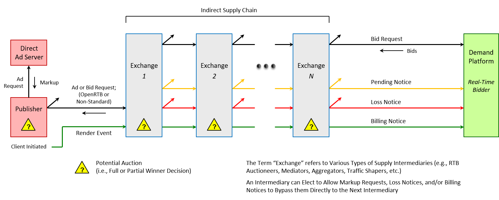
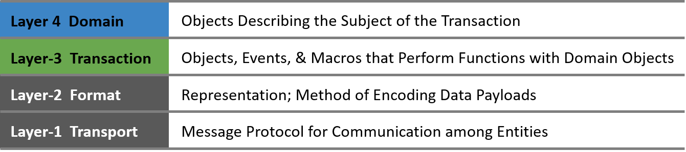
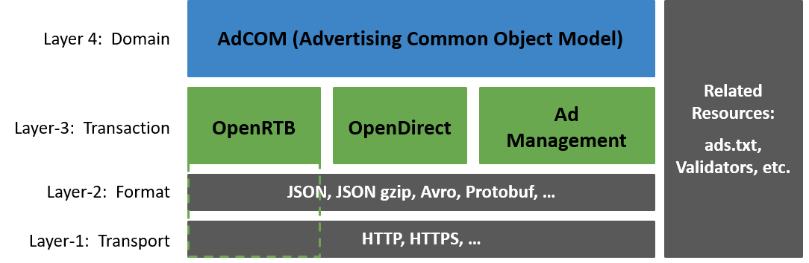
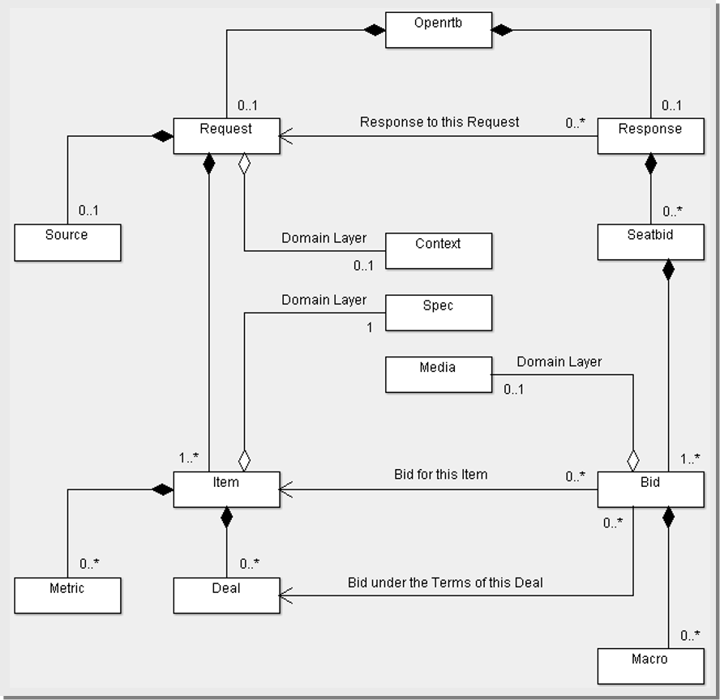

# OpenRTB 仕様 v3.0（日本語訳）
<!--
# OpenRTB Specification v3.0
-->

*本文書は OpenRTB v3.0 FINAL を日本語に翻訳したものです。*

* 文献：[openrtb/OpenRTB v3.0 FINAL.md at master · InteractiveAdvertisingBureau/openrtb](https://github.com/InteractiveAdvertisingBureau/openrtb/blob/master/OpenRTB%20v3.0%20FINAL.md)
* 翻訳者：皆川祥（株式会社 LOB）
* ライセンス：[Creative Commons Attribution 3.0](http://creativecommons.org/licenses/by/3.0/)
* 問い合わせ：[Issues · msh5/openrtb-translate-jp](https://github.com/msh5/openrtb-translate-jp/issues/new)

---

#### 最終版 v1.0
<!--
#### FINAL v1.0
-->

**2018年11月**
<!--
**November 2018**
-->

**IAB テクノロジーラボについて**
<!--
**About the IAB Technology Lab**
-->

IAB テクノロジーラボラトリ（テックラボ）は、標準化仕様、ソフトウェア、およびサービスを制作・提供することで、効果的かつ持続可能なグローバルデジタルメディアエコシステムの成長を促進させる非営利の研究開発団体です。 IAB テックラボは、デジタル配信事業者や広告技術会社、さらにマーケティング担当者、代理店、インタラクティブマーケティング分野に関心のある会社で構成され、モバイルおよびテレビ・デジタルビデオチャネルの有効化に重点を置くことで、透明で安全かつ効果的なサプライチェーン、よりシンプルで一貫した成果測定、そして消費者にとってのより良い広告体験を通じて、ブランドとメディアの成長を実現することを目指しています。 IAB テックラボは、消費者、配信事業者、広告主、およびサードパーティプラットフォームのデジタル体験を向上させるために設計された、DigiTrust 標準リアルタイムアイデンティティサービスも所有しています。ボードメンバーには AppNexus、ExtremeReach、Google、GroupM、Hearst Digital Media、Integral Ad Science、Index Exchange、LinkedIn、MediaMath、Microsoft、Moat、Pandora、PubMatic、Quantcast、Telaria、Yahoo! Japan が参加しています。 IAB テックラボは 2014 年に設立され、ニューヨークに本社を置いています。さらに、サンフランシスコに事務所、シアトルとロンドンに代理店を構えています。
<!-- 
The IAB Technology Laboratory (Tech Lab) is a non-profit research and development consortium that produces and provides standards, software, and services to drive growth of an effective and sustainable global digital media ecosystem. Comprised of digital publishers and ad technology firms, as well as marketers, agencies, and other companies with interests in the interactive marketing arena, IAB Tech Lab aims to enable brand and media growth via a transparent, safe, effective supply chain, simpler and more consistent measurement, and better advertising experiences for consumers, with a focus on mobile and TV/digital video channel enablement. The IAB Tech Lab portfolio includes the DigiTrust real-time standardized identity service designed to improve the digital experience for consumers, publishers, advertisers, and third-party platforms. Board members include AppNexus, ExtremeReach, Google, GroupM, Hearst Digital Media, Integral Ad Science, Index Exchange, LinkedIn, MediaMath, Microsoft, Moat, Pandora, PubMatic, Quantcast, Telaria, The Trade Desk, and Yahoo! Japan.  Established in 2014, the IAB Tech Lab is headquartered in New York City with an office in San Francisco and representation in Seattle and London.
-->

IAB テックラボについては、[www.iabtechlab.com](https://www.iabtechlab.com) でさらに知ることが出来ます。
<!--
Learn more about IAB Tech Lab at [www.iabtechlab.com](https://www.iabtechlab.com).
-->

**ライセンス（訳注：元文献）**
<!-- **License** -->

OpenRTB 仕様 IAB テックラボは Creative Commons Attribution 3.0 でライセンスされています。 ライセンスのコピーを見るには、[ creativecommons.org/licenses/by/3.0/](http://creativecommons.org/licenses/by/3.0/) を訪れるか 「Creative Commons, 171 Second Street, Suite 300, San Francisco, CA 94105, USA」へ問い合わせて下さい。
<!--
OpenRTB Specification the IAB Tech Lab is licensed under a Creative Commons Attribution 3.0 License. To view a copy of this license, visit[ creativecommons.org/licenses/by/3.0/](http://creativecommons.org/licenses/by/3.0/) or write to Creative Commons, 171 Second Street, Suite 300, San Francisco, CA 94105, USA.
-->


<!--

-->

**目次**
<!-- 
**TABLE OF CONTENTS**
-->

- [概要](#overview)
  - [OpenMedia のミッション](#openmediamission)
  - [OpenRTB の歴史](#historyofopenrtb)
  - [バージョン変遷](#versionhistory)
    - [OpenRTB リアルタイム入札 API](#openrtbrealtimebiddingapi)
    - [OpenRTB ブロックリストブランチ](#openrtbblocklistbranch)
- [アーキテクチャ](#architecture)
  - [用語](#terminology)
  - [参照モデル](#referencemodel)
  - [プロトコルレイヤ](#protocollayers)
    - [レイヤ１：転送](#layer1_transport)
      - [コミュニケーション](#communications)
      - [バージョンヘッダ](#versionheaders)
      - [転送セキュリティ](#transportsecurity)
    - [レイヤ２：フォーマット](#layer2_format)
      - [表現](#representation)
      - [エンコーディング](#encoding)
    - [レイヤ３：トランザクション](#layer3_transaction)
    - [レイヤ４：ドメイン](#layer4_domain)
- [仕様](#specification)
  - [オブジェクトモデル](#objectmodel)
    - [オブジェクト：Openrtb](#object_openrtb)
  - [入札リクエストペイロード](#bidrequestpayload)
    - [オブジェクト：Request](#object_request)
    - [オブジェクト：Source](#object_source)
    - [オブジェクト：Item](#object_item)
    - [オブジェクト：Deal](#object_deal)
    - [オブジェクト：Metric](#object_metric)
  - [入札レスポンスペイロード](#bidresponsepayload)
    - [オブジェクト：Response](#object_response)
    - [オブジェクト：Seatbid](#object_seatbid)
    - [オブジェクト：Bid](#object_bid)
    - [オブジェクト：Macro](#object_macro)
  - [置換マクロ](#substitutionmacros)
  - [イベント通知](#eventnotification)
    - [イベント：保留](#event_pending)
    - [イベント：請求](#event_billing)
    - [イベント：敗北](#event_loss)
    - [複雑なイベントチェイン](#complexeventchains)
  - [在庫認証](#inventoryauthentication)
    - [Ads.cert 基本](#adscertprimer)
    - [詳細実装ガイド](#detailedimplementationguide)
  - [列挙子](#enumerations)
    - [リスト：非入札理由コード](#list_nobidreasoncodes)
    - [リスト：敗北理由コード](#list_lossreasoncodes)
- [例](#examples)
  - [入札リクエスト](#bidrequest)
  - [入札レスポンス](#bidresponse)
- [付録 A：追加資料](#appendixa_additionalresources)
- [付録 B：変更履歴](#appendixb_changelog)

<!-- 
- [OVERVIEW](#overview)
  - [OpenMedia Mission](#openmediamission)
  - [History of OpenRTB](#historyofopenrtb)
  - [Version History](#versionhistory)
    - [OpenRTB Real-Time Bidding API](#openrtbrealtimebiddingapi)
    - [OpenRTB Blocklist Branch](#openrtbblocklistbranch)
- [ARCHITECTURE](#architecture)
  - [Terminology](#terminology)
  - [Reference Model](#referencemodel)
  - [Protocol Layers](#protocollayers)
    - [Layer-1:  Transport](#layer1_transport)
      - [Communications](#communications)
      - [Version Headers](#versionheaders)
      - [Transport Security](#transportsecurity)
    - [Layer-2:  Format](#layer2_format)
      - [Representation](#representation)
      - [Encoding](#encoding)
    - [Layer-3:  Transaction](#layer3_transaction)
    - [Layer-4:  Domain](#layer4_domain)
- [SPECIFICATION](#specification)
  - [Object Model](#objectmodel)
    - [Object:  Openrtb](#object_openrtb)
  - [Bid Request Payload](#bidrequestpayload)
    - [Object:  Request](#object_request)
    - [Object:  Source](#object_source)
    - [Object:  Item](#object_item)
    - [Object:  Deal](#object_deal)
    - [Object:  Metric](#object_metric)
  - [Bid Response Payload](#bidresponsepayload)
    - [Object:  Response](#object_response)
    - [Object:  Seatbid](#object_seatbid)
    - [Object:  Bid](#object_bid)
    - [Object:  Macro](#object_macro)
  - [Substitution Macros](#substitutionmacros)
  - [Event Notification](#eventnotification)
    - [Event:  Pending](#event_pending)
    - [Event:  Billing](#event_billing)
    - [Event:  Loss](#event_loss)
    - [Complex Event Chains](#complexeventchains)
  - [Inventory Authentication](#inventoryauthentication)
    - [Ads.cert Primer](#adscertprimer)
    - [Detailed Implementation Guide](#detailedimplementationguide)
  - [Enumerations](#enumerations)
    - [List:  No-Bid Reason Codes](#list_nobidreasoncodes)
    - [List:  Loss Reason Codes](#list_lossreasoncodes)
- [EXAMPLES](#examples)
  - [Bid Request](#bidrequest)
  - [Bid Response](#bidresponse)
- [Appendix A:  Additional Resources](#appendixa_additionalresources)
- [Appendix B:  Change Log](#appendixb_changelog)
-->

# 概要 <a name="overview">
<!-- 
# OVERVIEW <a name="overview"></a>
-->

## OpenMedia のミッション <a name="openmediamission"></a>
<!-- 
## OpenMedia Mission <a name="openmediamission"></a>
-->

OpenMedia プロジェクトのミッションは、広告主である買い手と配信在庫を抱える売り手との間のコミュニケーションを実現するオープンな業界標準の提供によって、プログラマチック広告市場の成長を加速させることです。この標準には、実際のリアルタイム入札プロトコル、情報分類、オフライン構成同期といった内容が含まれますが、これらに限定されるものではありません。
<!-- 
The mission of the OpenMedia project is to spur growth in programmatic marketplaces by providing open industry standards for communication between buyers of advertising and sellers of publisher inventory. There are several aspects to these standards including but not limited to the actual real-time bidding protocol, information taxonomies, offline configuration synchronization, and many more.
-->

本ドキュメントは、リアルタイム入札（Real-Time Bidding; RTB）のインタフェイス標準を規定しています。これらのプロトコル標準は、配信在庫の供給者（つまり、取引所、配信者と連携しているネットワーク、売り手サイドのプラットフォーム）と競争的なその在庫の買い手（つまり、入札者、買い手サイドのプラットフォーム、もしくは広告主と連携しているネットワーク）の間の繋がりをシンプルにすることを目的としています。
<!--
This document specifies a standard for the Real-Time Bidding (RTB) Interface. This protocol standard aims to simplify the connection between suppliers of publisher inventory (i.e., exchanges, networks working with publishers, and supply-side platforms) and competitive buyers of that inventory (i.e., bidders, demand side platforms, or networks working with advertisers).
-->

OpenRTB の全体目標は、買い手と売り手の間のコミュニケーションにおける「リンガフランカ (訳注：共通言語)」 を作成することです。 その目的は、各当事者がどのようにビジネスを行うかを正確に規制することではありません。プロジェクトとして私たちは、技術革新が「水道管よりも」深いレベルで起こるように当事者間の接続を容易にすることを目指しています。
<!--
The overall goal of OpenRTB is and has been to create a *lingua franca* for communicating between buyers and sellers. The intent is not to regulate exactly how each party conducts business. As a project, we aim to make integration between parties in the ecosystem easier so that innovation can happen at a deeper-level than the pipes.
-->

## OpenRTB の歴史 <a name="historyofopenrtb"></a>
<!--
## History of OpenRTB <a name="historyofopenrtb"></a>
-->

OpenRTB は、2010年11月に3つの買い手側プラットフォーム（dataxu、MediaMath、Turn）と3つの売り手側プラットフォーム（Admeld、PubMatic、Rubicon プロジェクト）による、パイロットプロジェクトとして立ち上げられました。当初の目標は、ブロックリストを取引するための当事者間通信を標準化することでした。そうして、OpenRTB ブロックリスト仕様のバージョン 1.0 が 2010年12月にリリースされました。
<!--
OpenRTB was launched as a pilot project between three demand-side platforms (dataxu, MediaMath, and Turn) and three sell-side platforms (Admeld, PubMatic, and The Rubicon Project) in November 2010. The first goal was to standardize communication between parties for exchanging block lists. Version v1.0 of the OpenRTB block list specification was released in December 2010.
-->

業界からのポシティブな反応を経て、Nexage は実際のリアルタイム入札要求・応答プロトコルに焦点を当て、さらにモバイル広告をサポートする点に特筆した OpenRTB の API 仕様を作成するという提案を、OpenRTB プロジェクトに持ち込みました。そしてモバイル小委員会が、買い手サイドを代表する企業（dataxu、Fiksu、[X+1]）と売り手サイドを代表する企業（Nexage、Pubmatic、Smaato、Jumptap）の間で結成されました。このプロジェクトによって、OpenRTB v1.0 モバイル仕様が生まれ、2011年2月にリリースされました。
<!--
After a positive response from the industry, Nexage approached the OpenRTB project with a proposal to create an API specification for OpenRTB focusing on the actual real-time bid request/response protocol and specifically to support mobile advertising. The mobile subcommittee was formed between companies representing the buy-side (dataxu, Fiksu, and [X+1]) and companies representing the sell-side (Nexage, Pubmatic, Smaato, and Jumptap). This project resulted in the OpenRTB v1.0 Mobile specification, which was released in February 2011.
-->

モバイル仕様のリリースに続いて、dataxu と ContextWeb が協業する動画広告取引所（BrightRoll、Adap.tv）のための、動画小委員会が結成されました。 その目標は、ディスプレイ、動画、モバイルのサポートを一つに統合することでした。 この取り組みによりOpenRTB 2.0 が生まれ、これが2011年6月に統一規格としてリリースされました。
<!--
Following the release of the mobile specification, a video subcommittee was formed with video ad exchanges (BrightRoll and Adap.tv) collaborating with dataxu and ContextWeb to incorporate support for video. The goal was to incorporate support for display, video, and mobile in one document. This effort resulted in OpenRTB v2.0, which was released as a unified standard in June 2011.
-->

OpenRTB は業界で非常に幅広く採用されたため、2012年1月のバージョン 2.1 のリリースに併せて IAB 標準として発行されました。仕様の技術的内容に関する意思決定は、OpenRTB コミュニティとそのガバナンスルールに基づきます。
<!--
Due to very widespread adoption by the industry, OpenRTB was established as an IAB standard in January 2012 with the release of version v2.1. Governance over the technical content of the specification remained with the OpenRTB community and its governance rules.
-->

それ以来、プログラマチック広告は業界で支配的な強制力を持つようになりました。 しかし、これによってサプライチェーンがますます複雑化し、不正行為やその他のリスクが増加する可能性があります。これが OpenRTB v3.0 を推進する鍵となる動機の一つです。
<!--
In the years since, programmatic advertising has become a dominant force in the industry. However, this has also led to an increasingly complex supply chain which may increase fraud rates and other risks. This is one of the key motivators driving OpenRTB v3.0.
-->

## バージョン変遷 <a name="versionhistory"></a>
<!--
## Version History <a name="versionhistory"></a>
-->

### OpenRTB リアルタイム入札 API <a name="openrtbrealtimebiddingapi"></a>
<!--
### OpenRTB Real-Time Bidding API <a name="openrtbrealtimebiddingapi"></a>
-->

3.0 複雑なサプライチェーン、階層化仕様アーキテクチャ、在庫信頼性のためのデジタル署名
<!--
3.0	Complex supply chains, layered specification architecture, and digital signing for inventory authenticity.
-->

2.5 ヘッダービディング、請求および敗北通知、フレックス広告、請求 ID、戦略 ID、インプレッションメトリック、アウトストリームビデオ、その他多くの軽微な機能拡張をサポート。
<!--
2.5	Support for header bidding, billing and loss notifications, Flex Ads, Payment ID, tactic ID, impression metrics, out-stream video, and many more minor enhancements.
-->

2.4 オーディオ広告枠のサポートと、2.x バージョンで最も多くの軽度から中程度の機能拡張。
<!--
2.4	Support for Audio ad units and the largest set of minor to moderate enhancements in v2.x history.
-->

2.3 ネイティブ広告枠のサポートと、複数の軽微な機能拡張。
<!--
2.3	Support for Native ad units and multiple minor enhancements.
-->

2.2 非公開市場直接取引、動画、モバイル、および規制信号に関する新しい機能拡張。
<!--
2.2	New enhancements for private marketplace direct deals, video, mobile, and regulatory signals.
-->

2.1 IQG コンプライアンス、軽微な機能拡張、および訂正のための改訂。
<!--
2.1	Revisions for IQG compliance, minor enhancements, and corrections.
-->

2.0 ディスプレイ、モバイル、動画の標準を統一仕様へ統合。
<!--
2.0	Combines display, mobile, and video standards into a unified specification.
-->

1.0 OpenRTB モバイルの初回リリース。
<!--
1.0	Original Release of OpenRTB Mobile.
-->

### OpenRTB ブロックリストブランチ
<!--
### OpenRTB Blocklist Branch <a name="openrtbblocklistbranch"></a>
-->

1.2 配信者設定 API (提案済み)。
<!--
1.2	Publisher Preferences API (proposed).
-->

1.1 クリエイティブ属性のリアルタイム取引を含める軽微な変更。
<!--
1.1	Minor edits to include real-time exchange of creative attributes.
-->

1.0 OpenRTB ブロックリスト仕様の初回リリース。
<!--
1.0	Original Release of OpenRTB blocklist specifications.
-->

# アーキテクチャ <a name="architecture"></a>
<!--
# ARCHITECTURE <a name="architecture"></a>
-->

この章では仕様の詳細が正しく理解できるように、RTB トランザクションが適用されるエコシステムの基本モデルと、OpenRTB の全体構成について説明します。
<!--
This section describes the underlying model of the ecosystem to which RTB transactions apply and the overall organization of OpenRTB so that specification details have proper context.
-->

## 用語 <a name="terminology"></a>
<!--
## Terminology <a name="terminology"></a>
-->

以下の用語はこの文書を通して、OpenRTB および本仕様の文脈の上で明確な意味を持って使用されています。
<!--
The following terms are used throughout this document specifically in the context of OpenRTB and this specification.
-->

<table>
  <tr>
    <td><strong>用語</strong></td>
    <td><strong>定義</strong></td>
  </tr>
  <tr>
    <td>RTB</td>
    <td>リアルタイムもしくは準リアルタイムな商品への入札。</td>
  </tr>
  <tr>
    <td>サプライソース</td>
    <td>配信者ないし在庫を売るオーディエンスソース。</td>
  </tr>
  <tr>
    <td>取引所</td>
    <td>商品単位で入札者間のオークションを執りしきる主体。（例：SSP）</td>
  </tr>
  <tr>
    <td>仲介者</td>
    <td>サプライソースとデマンドソースの間にある主体。（例：取引所）</td>
  </tr>
  <tr>
    <td>サプライチェーン</td>
    <td>最後のサプライソースとデマンドソースまでの間にある複数の仲介者のセット。</td>
  </tr>
  <tr>
    <td>デマンドソース</td>
    <td>オークションにおいて商品への入札を行う主体。（例：DSP）</td>
  </tr>
  <tr>
    <td>シート</td>
    <td>商品の獲得を目指して、デマンドプラットフォームを使用する購入主体（例：広告主、代理店）。通常は購入予算の所有者。</td>
  </tr>
  <tr>
    <td>取引</td>
    <td>特定条件下における商品購入についての売り手・買い手間の協定。</td>
  </tr>
</table>

<!--
<table>
  <tr>
    <td><strong>Term</strong></td>
    <td><strong>Definition</strong></td>
  </tr>
  <tr>
    <td>RTB</td>
    <td>Bidding for individual items in real-time or near real-time.</td>
  </tr>
  <tr>
    <td>Supply&nbsp;Source</td>
    <td>The publisher or other audience source selling inventory.</td>
  </tr>
  <tr>
    <td>exchange</td>
    <td>An entity (e.g., an SSP) that conducts an auction among bidders per item.</td>
  </tr>
  <tr>
    <td>Intermediary</td>
    <td>An entity in the path between supply and demand sources</td>
  </tr>
  <tr>
    <td>Supply&nbsp;Chain</td>
    <td>A set of 1+ intermediaries between the ultimate supply and demand sources.</td>
  </tr>
  <tr>
    <td>Demand&nbsp;Source</td>
    <td>An entity (e.g., a DSP) that bids for items into an auction.</td>
  </tr>
  <tr>
    <td>Seat</td>
    <td>A buying entity (e.g., advertiser, agency) that wishes to obtain items and use a demand platform to act on its behalf; usually the owner of the buying budget.</td>
  </tr>
  <tr>
    <td>Deal</td>
    <td>An agreement between sellers and buyers to purchase items under certain terms.</td>
  </tr>
</table>
-->

## 参照モデル <a name="referencemodel"></a>
<!--
## Reference Model <a name="referencemodel"></a>
-->

OpenRTB は一般的に、取引所とデマンドソース、あるいは競売人と入札者の間で起こるインタラクションであると考えれるでしょう。つまり、OpenRTB は小商品（例：広告インプレッション）を販売する方法を定義していて、取引所からそのデマンドパートナーへ入札リクエストを公告し、レスポンスの中から入札を集め、オークションルールのいずれかの形式に基づいて勝者を決定します。取引所によっては、入札が受け入れられたことを各買い手へ通知し、ビジネスポリシーに基づいて入札が請求可能とみなされた時点で（例：広告マークアップの描画）、清算価格といった重要なデータとともに勝利した買い手へ通知します。一方、勝利した以外の買い手へはオークションに負けたことを通知します。
<!--
OpenRTB is generally thought of as the interaction between an exchange and its demand sources or sometimes as the auctioneer and its bidders. With that focus, OpenRTB defines a method of selling micro-commodities (e.g., advertising impressions) by broadcasting bid requests from the exchange to its demand partners, collecting bids in response, and determining a winner based on some form of auction rules. An exchange may notify buyers that their bids have been accepted and when a bid becomes billable based on exchange business policy (e.g., rendered markup), the exchange notifies the winning buyer with critical data such as the clearing price. Others may be notified that they lost the auction.
-->

しかし、昨今のエコシステムははるかに複雑です。ヘッダービディングが極めて一般的になったことで、配信者やユーザーエージェント、あるいはその近くに新たな裁定点が生まれ、取引所をもはや唯一の裁定者ではありません。さらに、複数のサプライチェーン仲介者を持つことが一般的となりました。中間事業者あるいは取引所によっては、直接的に接続しているデマンドに限らず、別の取引所をデマンドソースとして使用します。
<!--
Today’s ecosystem is much more complicated, however. Header bidding has become extremely common, which results in a new decision point at or near the publisher or user agent rendering the exchange as no longer the sole decider. It has also become common to have more than one supply chain intermediary; perhaps a mediator or exchange which uses another exchange as a demand source in addition to its own directly integrated demand.
-->

これらの構造は、次の参照モデル図で示されています。取引所は上流の仲介者（向かって左）に対して、入札を行うデマンドソースとして振る舞うことが可能です。また、下流の取引所および DSP（向かって右）をデマンドソースとして使用することができます。ただしこの図は、*N* 個の取引所あるいはサプライ仲介者を一般的なケースにおいて示したもので、実務上の考慮事項（例：レイテンシ、レベニューシェアの連続など）によって自然な範囲での制限が課されることがあるでしょう。
<!--
These structures are depicted in the reference model diagram that follows, where an exchange may itself act as a demand source bidding into an upstream (to the left) intermediary and/or use other downstream (to the right) exchanges and DSPs as demand sources. Note that although the figure shows the general case of *N* exchanges or supply intermediaries, practical considerations (e.g., latency, successive revenue shares, etc.) will tend to impose natural limits.
-->


<!--

-->

OpenRTB の入札リクエスト、入札レスポンス、およびイベントはこれら主体の各ペア間で実装できます。しかし配信者間の接続については、ここでは配信者から Exchange 1 へ示されていますが、一般に標準化されていません。所与の主体がより大きなサプライチェーンを認識しているかもしれませんし、そうでないかもしれませんが、少なくともこのチェーンが配信者によって異なることがあることを考慮しています。いずれにせよ OpenRTB は、少なくとも所与のトランザクションにおいて、所与の主体が左（サプライ側; 上流）および右（デマンド側; 下流）に隣接する直接的に実装された主体とのビジネス関係のみを有すると仮定します。
<!--
OpenRTB bid requests, bid responses, and events can be implemented between any pair of these entities although the publisher integrations, depicted here as publisher to Exchange-1, are usually less standardized. A given entity may or may not be aware of the larger supply chain, but consider that this chain may vary for different publishers. In any case, OpenRTB assumes that a given entity only has a business relationship, at least within the context of a given transaction, with its directly implemented neighbors to the left (supply side; upstream) and the right (demand side; downstream).
-->

これの意味するところは、イベントの伝搬と非公開市場取引において説明できます。この参照モデル上で主体の立場から主観的に話すと：
<!--
The implications of this can be illustrated in event propagation and private marketplace deals. Speaking in the first person from the point of view of an entity in this reference model:
-->

* 私が受信した全ての保留、請求、敗北イベントは、私のサプライ側パートナー（私のすぐ左の主体）から来ている、もしくはその完全な権限を有しているものとみなします。

<!--
* I assume that all pending, billing, or loss events I receive are either from or with the full authority of my supply side partner (i.e., the entity to my immediate left).
-->

* 私には、保留、請求、敗北イベントを私のデマンド側パートナー（私のすぐ右の直接接続された主体）に対してのみ送信する責任があります。

<!--
* I am responsible for sending pending, billing, and loss events only to my demand-side partners (i.e., the directly integrated entities to my immediate right).
-->

* 私は、サプライ側パートナー（私のすぐ左の主体）とデマンド側パートナー（私のすぐ右の主体）の間の取引を、仲介および実行します。さらにチェーンの上流もしくは下流へ私の取引を伝搬する責務は、OpenRTB の下で他の主体にありません。

<!--
* I broker and execute deals among my supply and demand partners (i.e., the entities to my immediate left and right).  No other entity has any obligation under OpenRTB to extend or propagate my deals further up or down the chain.
-->

## プロトコルレイヤ <a name="protocollayers"></a>
<!--
## Protocol Layers <a name="protocollayers"></a>
-->

異なる仕様間におけるオブジェクトの再利用を支援し、仕様の個々の面が各自のペースで発展できるように、OpenRTB v3.0 以降では階層化アプローチが採用されています。このモデルを次に図示します。形式はらずに表現すれば、レイヤ１は当事者間でバイトデータを移動し、レイヤ２はこのバイトデータの言語を表現し、レイヤ３はこの言語を使ったトランザクション（売買の執行）を指定し、レイヤ４はトランザクション処理される商品について説明しています。
<!--
To assist in reuse of objects across different specifications and to enable various aspects of the specification to evolve at different paces, a layered approach is being adopted as of OpenRTB v3.0.  The following illustrates this model. Expressed informally, Layer-1 moves bytes between parties, Layer-2 expresses the language of these bytes, Layer-3 specifies a transaction using this language, and Layer-4 describes the goods being transacted.
-->


<!--

-->

こういった階層化された概念を踏まえて、IAB テックラボは「Open Media」として関連仕様を包括的に構成する定義をしています。仕様の概要とプロトコルレイヤへどのように落としこまれているかは、次に説明しています。
<!--
Given this layered concept, the IAB Tech Lab has defined an overall organization of related specifications as "Open Media". The landscape of these specifications and how they may be organized into protocol layers is illustrated as follows.
-->


<!--

-->

次の節では、OpenRTB 仕様に関係するこれらのレイヤについて指定します。明示的に指定されておらず、任意であるという注釈が付けられておらず、かつベストプラクティスとして言及されていなければ、これらの節のすべての重要な点は OpenRTB 準拠の要件になります。
<!--
The following subsections specify these layers as they pertain to the OpenRTB specification. Unless explicitly specified otherwise, annotated as optional, or called out as a best practice, all material aspects of these subsections are required for OpenRTB compliance.
-->

### レイヤ１：転送 <a name="layer1_transport"></a>
<!--
### Layer-1:  Transport <a name="layer1_transport"></a>
-->

#### コミュニケーション <a name="communications"></a>
<!--
#### Communications <a name="communications"></a>
-->

取引所とそのデマンドソースとの間の基本プロトコルは HTTP です。 特に、入札リクエストを HTTP GET よりも大きなペイロードに対応し、かつバイナリ表現の使用を容易にするために HTTP POST が必要とされます。 通知イベントは、取引所の裁量で POST または GET のいずれでも構いません。
<!--
The base protocol between an exchange and its demand sources is HTTP. Specifically, HTTP POST is required for bid requests to accommodate greater payloads than HTTP GET and facilitate the use of binary representations. Notification events may be either POST or GET at the discretion of the exchange.
-->

コンテンツを返す呼び出し（例：入札レスポンス）には、 HTTP コード 200 が返るべきです。有効なリクエストへのレスポンスにコンテンツを返さない呼び出し（例：非入札やイベント通知を示す一つの方法である空の入札レスポンス）には、HTTP 204 が返るべきです。無効な呼び出し（例：不正な形式や壊れたペイロードを含む入札リクエスト）には、コンテンツ無しで HTTP 400 が返るべきです。
<!--
Calls returning content (e.g., a bid response) should return HTTP code 200.  Calls returning no content in response to valid requests (e.g., an empty bid response which is one option for indicating no-bid, an event notification) should return HTTP 204. Invalid calls (e.g., a bid request containing a malformed or corrupt payload) should return HTTP 400 with no content.
-->

#### バージョンヘッダ <a name="versionheaders"></a>
<!--
#### Version Headers <a name="versionheaders"></a>
-->

OpenRTB のバージョンは、入札リクエストのヘッダの中でカスタムヘッダパラメータとして渡さなければなりません。 これによって入札者はリクエストを解析し始める前に、含まれているメッセージのバージョンを認識することができます。 バージョンは `<major>.<minor>` として指定するべきです。
<!--
The OpenRTB version must be passed in the header of a bid request with a custom header parameter. This will allow bidders to recognize the version of the message contained before attempting to parse the request. This version should be specified as <major>.<minor>.
-->

`x-openrtb-version: 3.0`

さらにレスポンスは、応答者が実装したプロトコルバージョンと同じ形式の HTTP ヘッダを含むことが、任意ではあるものの推奨されます。 しかし、すべてのレスポンスはリクエストのバージョンと互換性があり、そのバージョンのサポートは当事者間で事前に議論されているものと想定されます。
<!--
Additionally, it is recommended albeit optional that responses include an identically formatted HTTP header with the protocol version implemented by the responder.  It is assumed, however, that any response will be compatible with the version of the request and that version support is discussed *a priori* between the parties.
-->

**ベストプラクティス：** 接続パフォーマンスを向上させる最も簡単で効果的な方法の1つは、キープアライブとして知られる HTTP 永続接続を有効にすることです。 インタフェイスの両側での接続管理オーバーヘッドと CPU 使用率を削減することによって、全体的なパフォーマンスに大きな影響を与えます。
<!--
**BEST PRACTICE:**  One of the simplest and most effective ways of improving connection performance is to enable HTTP Persistent Connections, also known as Keep-Alive.  This has a profound impact on overall performance by reducing connection management overhead as well as CPU utilization on both sides of the interface.
-->

#### 転送セキュリティ <a name="transportsecurity"></a>
<!--
#### Transport Security <a name="transportsecurity"></a>
-->

OpenRTB v3.0 は準拠に Transport Layer Security（TLS）が必須であり、OpenRTB プロトコルが動作するすべての接続は HTTPS でなければなりません。 セキュアでない HTTP を未だに使用している従来の接続は、もはや準拠しているとはみなされません。
<!--
As of OpenRTB v3.0, Transport Layer Security (TLS) is required for compliance and thus all connections over which the OpenRTB protocol operates must be HTTPS.  Legacy integrations that still use unsecured HTTP are will no longer be considered compliant.
-->

### レイヤ２：形式 <a name="layer2_format"></a>
<!--
### Layer-2:  Format <a name="layer2_format"></a>
-->

#### *表現* <a name="representation"></a>
<!--
#### *Representation* <a name="representation"></a>
-->

JSON（JavaScript Object Notation）は、入札リクエストと入札レスポンスのデータペイロードのためのデフォルト形式です。 JSONは、人間の読みやすさとコンパクトさを組み合わせたものです。
<!--
JSON (JavaScript Object Notation) is the default format for bid request and bid response data payloads. JSON was chosen for its combination of human readability and relative compactness.
-->

取引所は任意で、バイナリ形式（例：圧縮 JSON、ProtoBuf、Avro など）を提供しても構いません。これは送信時間や帯域幅といった点で効率的になることがあります。IAB テックラボは、これらの形式もしくは他の形式のリファレンス実装を提供することがあります。可能であれば接続の差異を減らすために、IAB リファレンス実装の使用を強く推奨します。
<!--
Optionally, an exchange may also offer binary representations (e.g., compressed JSON, ProtoBuf, Avro, etc.), which can be more efficient in terms of transmission time and bandwidth.  The IAB Tech Lab may offer reference implementations for these or other formats. When available, the use of these IAB reference implementations is highly recommended to reduce integration variations.
-->

入札リクエストでは Content-Type HTTP ヘッダを使用し、MIME タイプとしてその表現を指定します。標準的な JSON 表現を表す MIME タイプは `application/json` です。入札レスポンスの形式は、入札リクエストと同じでなければなりません。
<!--
The bid request specifies the representation as a mime type using the Content-Type HTTP header. The mime type for the standard JSON representation is `application/json` as shown.  The format of the bid response must be the same as the bid request.
-->

`Content-Type: application/json`	

標準とは別のバイナリ形式が使用される場合、取引所または SSP は Content-Type を適切に指定すべきです。例えば「Content-Type: avro/binary」もしくは「Content-Type: application/x-protobuf」とします。 Content-Type が見つからない場合は、取引所によって別のデフォルト形式が選択されていないかぎり、入札者は application/json であると想定すべきです。
<!--
If alternative binary representations are used, the exchange or SSP should specify the Content-Type appropriately. For example:  `avro/binary` or `application/x-protobuf`.  If the content-type is missing, the bidder should assume the type is `application/json`, unless a different default has been selected by an exchange.
-->

#### *エンコーディング* <a name="encoding"></a>
<!--
#### *Encoding* <a name="encoding"></a>
-->

取引所とデマンドソース間で送られるデータを圧縮することは非常に有益です。圧縮により転送されるデータのサイズが大幅に縮小され、取引所およびデマンドソースの双方でネットワーク帯域幅が節約されます。 この節約を完全に実現するために、取引所から送られる入札リクエストとデマンドソースら返される入札レスポンスの双方に対して、圧縮を有効にすべきです。
<!--
Compressing data sent between exchanges and demand sources can be very beneficial. Compression greatly reduces the size of data transferred and thus saves network bandwidth for both exchanges and demand sources. To realize this savings fully, compression should be enabled for both the bid request sent by the exchange and the bid response returned by the demand source.
-->

標準的な HTTP 1.1 機構を用いて、入札レスポンスにおける圧縮を有効にすることができます。多くの Web サーバは既にレスポンス情報の gzip 圧縮をサポートしており、それは理想的な選択です。取引所が圧縮されたレスポンスを欲していることを伝えるには、HTTP 1.1 Accept-Encoding ヘッダを設定すべきです。エンコーディング値は `gzip` が用いられるべきです。
<!--
Compression can be enabled on the bid response using standard HTTP 1.1 mechanisms. Most web servers already support gzip compression of response content and as such it is an ideal choice. For an exchange to signal they would like the response to be compressed, it should set the standard HTTP 1.1 Accept-Encoding header. The encoding value used should be `gzip`.
-->

`Accept-Encoding: gzip`

このヘッダは、gzip エンコーディングされたレスポンスを受け入れることができるという取引所の指示を、デマンドソースに提示します。デマンドソースサーバがこれをサポートし正しく構成されていれば、gzip でエンコードされた情報で自動的に応答します。これは HTTP 1.1 Content-Encoding ヘッダを用いて示されます。
<!--
This header represents to demand sources an indication by the exchange that it is capable of accepting gzip encoding for the response. If a demand source server supports this and is correctly configured, it will automatically respond with content that is gzip encoded. This will be indicated using the standard HTTP 1.1 Content-Encoding header.
-->

`Content-Encoding: gzip`

入札リクエストに対して圧縮を有効にするには、まず取引所とデマンドソース間でこれをサポートされていることが合意されなければなりません。取引所が入札リクエストを送信する前に形式とエンコーディングの両方を知っていなければならないので、カスタムデータ形式が用いられる場合と似ています。デマンドソースがサポートしている場合、取引所は HTTP 1.1 Content-Encoding ヘッダを設定して、gzip 圧縮した入札リクエストを送信していることを示すべきです。用いられるエンコーディング値は `gzip` であるべきです。
<!--
To enable compression on the bid request, it must first be agreed upon between the exchange and the demand source that this is supported. This is similar to when a custom data format is used since the exchange has to know both format and encoding before sending the bid request. If the demand source supports it, the exchange should indicate it is sending a gzip compressed bid request by setting the HTTP 1.1 Content-Encoding header. The encoding value used should be `gzip`.
-->

`Content-Encoding: gzip`

このヘッダが設定されていない場合、リクエスト情報はエンコードされていないものとみなされます。HTTP 1.1 では、通常 Content-Encoding ヘッダはレスポンス情報にのみに用いられます。しかしこのヘッダをリクエスト情報に用いることで、用いられるデータ形式に関係なくリクエストが圧縮されていることを示すことができます。これはバイナリデータ形式であっても、圧縮されることで恩恵を受けることができて便利です。
<!--
If this header is not set then it is assumed that the request content isn’t encoded. In HTTP 1.1, the Content-Encoding header is usually only used for response content. However by using this header for the request content as well we are able to indicate a request is compressed regardless of the data format used. This is useful since even binary data formats can benefit from being compressed.
-->

### レイヤ３：トランザクション <a name="layer3_transaction"></a>
<!--
### Layer-3:  Transaction <a name="layer3_transaction"></a>
-->

トランザクションレイヤは OpenRTB を含むリアルタイム入札プロトコルの心臓です。取引所とその入札者、より一般的にはサプライチェーン仲介者とその接続されたデマンドソースとの間の通商プロトコルを定義しています。
<!--
The Transaction Layer is the heart of the real-time bidding protocol that comprises OpenRTB. It defines the commerce protocol between an exchange and its bidders, or more generally a supply chain intermediary and its integrated demand sources.
-->

全詳細を知りたければ、このドキュメントの「仕様」の章を参考にしてください。
<!--
Refer to the Specification section of this document for full details.
-->

### レイヤ４：ドメイン <a name="layer4_domain"></a>
<!--
### Layer-4:  Domain <a name="layer4_domain"></a>
-->

ドメインレイヤは、トランザクションレイヤが動作するオブジェクトを定義していて、これはつまりメディアの取引を指しています。典型的な広告オークションでは、入札リクエストは二つの場所にドメインオブジェクトを含みます。まず一つ目に、サイト／アプリ、デバイス、ユーザーといった、販売に関する情報を記述するドメインオブジェクトが全てのリクエストに含まれます。二つ目に、インプレッションや配置の詳細、仕様、制限といった商品を定義するドメインオブジェクトが販売提供されている各商品に含まれます。そして、入札レスポンスもドメインオブジェクトを含んでいて、これはオークションに勝利した場合にユーザーに配信されるメディアを定義しています。
<!--
The Domain Layer defines the objects on which the Transaction Layer operates; the media exchange being transacted. In a typical advertising auction, the bid request would contain domain objects in two places. First, the overall request would contain domain objects that describe the context for the sale such as the site or app, the device, and the user.  Second, each item being offered for sale would contain domain objects that define the item such as impression and placement details, specifications, and restrictions. Each bid in a response would include domain objects that define the media to be delivered to the user if the auction is won.
-->

ドメインレイヤの仕様のバージョンは、トランザクションレイヤとは独立して変わることがあります。なので、トランザクションレイヤのルートオブジェクトには、ドメイン仕様とバージョン情報が含まれます。実際、異なるバージョン同士のサポートは、取引所やデマンドソースごとに時間の経過とともに変わるので、こういった点でも非常に重要です。
<!--
Since the version of the Domain Layer specification can vary independent of the Transaction Layer, the root object in the Transaction Layer includes domain specification and version information. This is also critical since support for different versions will vary over time by exchange and/or demand source.
-->

OpenRTB にとって、[広告共通オブジェクトモデル (Advertising Common Object Model; AdCOM)](https://github.com/InteractiveAdvertisingBureau/AdCOM) はデフォルトのドメインレイヤです。
<!--
For OpenRTB, the [Advertising Common Object Model (AdCOM)](https://github.com/InteractiveAdvertisingBureau/AdCOM) is the default Domain Layer.
-->

# 仕様 <a name="specification"></a>
<!--
# SPECIFICATION <a name="specification"></a>
-->

この章は、詳細な OpenRTB のトランザクションレイヤの仕様を含んでいます。明示的に指定されている、任意であるという注釈がある、もしくはベストプラクティスから参照されている場合を除いて、この章の全ての事柄が OpenRTB 準拠に必須となります。
<!--
This section contains the detailed OpenRTB transaction layer specification. Unless explicitly specified otherwise, annotated as optional, or called out as a best practice, all material aspects of this section are required for OpenRTB compliance.
-->

## オブジェクトモデル <a name="objectmodel"></a>
<!--
## Object Model <a name="objectmodel"></a>
-->

次の UML クラス図は、リクエストおよびレスポンスオブジェクトが含むペイロードの全体構造を図示しています。ペイロードは `Openrtb` という名前のついたオブジェクトをルートとし、`Openrtb` オブジェクトは `Request` と `Response` の共通のルートになります。そして、`Request` と `Response` はペイロードのタイプを決める２番目のルートです。
<!--
The UML class diagram that follows illustrates the overall payload structure including both request and response objects. Payloads are rooted in named objects; `Openrtb` as a common root and `Request` and `Response` as subordinate roots to identify the payload type.
-->


<!--

-->

この章を通じて、属性は「必須」もしくは「推奨」として示されます。まず、その属性を省略してしまうことでプロトコルが壊れてしまい、ビジネス価値の指標として保証されなくなるとき、属性は *必須* と示されます。そして、その属性を省略してもプロトコルは壊れないが、劇的にビジネス価値が落ちてしまう属性は *推奨* と示されます。
<!--
Throughout the object model subsections, attributes may be indicated as “Required” or “Recommended”.  Attributes are deemed *required* only if their omission would break the protocol and is not necessarily an indicator of business value otherwise.  Attributes are *recommended* when their omission would not break the protocol but would dramatically diminish business value.
-->

仕様順守の観点から、*必須* と示されていない全ての属性は、*推奨* か否かに関わらず任意になります。任意の属性は、省略された場合に推定されるデフォルト値を持っていても構いません。もしデフォルト値がないことを示されていれば、慣習的に *不明* として解釈されるべきです。また、空の文字列やヌル値は、省略されたものと同じと解釈されるべきです。（指定されていればデフォルト値、そうでなければ *不明*）
<!--
From a specification compliance perspective, any attribute not denoted *required* is optional, whether *recommended* or not. An optional attribute may have a default value to be assumed if omitted.  If no default is indicated, then by convention its absence should be interpreted as *unknown*, unless otherwise specified. Empty strings or null values should be interpreted the same as omitted (i.e., the default if one is specified or *unknown* otherwise).
-->

**ベストプラクティス：** 取引所とデマンドソースは、それがもつ拡張仕様上でどういったオブジェクトや属性を任意のオブジェクトとしてサポートしているかを、パートナーに公開することを勧めます。
<!--
**BEST PRACTICE:**  Exchanges and demand sources are encouraged to publish to their partners the set of optional objects and attributes they support along with any extensions to the specification.
-->

### オブジェクト：Openrtb <a name="object_openrtb"></a>
<!--
### Object:  Openrtb <a name="object_openrtb"></a>
-->

このトップレベルオブジェクトは、リクエストとレスポンス両方のペイロードにとってのルートです。バージョン情報と、トランザクションのベースとなるレイヤ４ドメインモデルへの参照を含みます。OpenRTB で使われるドメインモデルは、デフォルトで広告共通オブジェクトモデル（AdCOM）となります。
<!--
This top-level object is the root for both request and response payloads. It includes versioning information and references to the Layer-4 domain model on which transactions are based. By default, the domain model used by OpenRTB is the Advertising Common Object Model (AdCOM).
-->

注釈：このドキュメント上でのルールとして、Java のようなプログラム言語のクラス名の共通ルールに沿い、定義されるオブジェクトは大文字の頭文字で示されます。一方で、オブジェクトの実インスタンスと、ペイロード上のそこへの参照は小文字で示されます。
<!--
Note: As a convention in this document, objects being defined are denoted with uppercase first letter in deference to the common convention for class names in programming languages such as Java, whereas actual instances of objects and references thereto in payloads are lowercase.
-->

<table>
  <tr>
    <td><strong>属性&nbsp;&nbsp;&nbsp;&nbsp;&nbsp;&nbsp;&nbsp;&nbsp;</strong></td>
    <td><strong>型&nbsp;&nbsp;&nbsp;&nbsp;&nbsp;&nbsp;&nbsp;&nbsp;&nbsp;&nbsp;&nbsp;&nbsp;&nbsp;&nbsp;&nbsp;&nbsp;&nbsp;&nbsp;&nbsp;&nbsp;</strong></td>
    <td><strong>定義</strong></td>
  </tr>
  <tr>
    <td><code>ver</code></td>
    <td>文字列</td>
    <td>OpenRTB レイヤ３仕様のバージョン（例: "3.0"）。</td>
  </tr>
  <tr>
    <td><code>domainspec</code></td>
    <td>文字列;<br/>デフォルト “adcom”</td>
    <td>販売中の商品、入札に対応するメディアなどを定義するために使われる、レイヤ４ドメインモデルの ID。</td>
  </tr>
  <tr>
    <td><code>domainver</code></td>
    <td>文字列;&nbsp;必須</td>
    <td><code>domainspec</code> 属性で参照されるレイヤ４ドメインモデル仕様のバージョン。</td>
  </tr>
  <tr>
    <td><code>request</code></td>
    <td>オブジェクト;&nbsp;必須&nbsp;※</td>
    <td>入札リクエストのコンテナ。 ※リクエストのペイロードにのみ必須。 <a href="#object_request">オブジェクト: Request</a>を参考のこと。</td>
  </tr>
  <tr>
    <td><code>response</code></td>
    <td>オブジェクト;&nbsp;必須&nbsp;※</td>
    <td>入札レスポンスのコンテナ。 ※レスポンスのペイロードにのみ必須。 <a href="#object_response">オブジェクト: Response</a>を参考のこと。</td>
  </tr>
</table>

<!--
<table>
  <tr>
    <td><strong>Attribute&nbsp;&nbsp;&nbsp;&nbsp;&nbsp;&nbsp;&nbsp;&nbsp;</strong></td>
    <td><strong>Type&nbsp;&nbsp;&nbsp;&nbsp;&nbsp;&nbsp;&nbsp;&nbsp;&nbsp;&nbsp;&nbsp;&nbsp;&nbsp;&nbsp;&nbsp;&nbsp;&nbsp;&nbsp;&nbsp;&nbsp;</strong></td>
    <td><strong>Definition</strong></td>
  </tr>
  <tr>
    <td><code>ver</code></td>
    <td>string</td>
    <td>Version of the Layer-3 OpenRTB specification (e.g., "3.0").</td>
  </tr>
  <tr>
    <td><code>domainspec</code></td>
    <td>string;<br/>default “adcom”</td>
    <td>Identifier of the Layer-4 domain model used to define items for sale, media associated with bids, etc.</td>
  </tr>
  <tr>
    <td><code>domainver</code></td>
    <td>string;&nbsp;required</td>
    <td>Specification version of the Layer-4 domain model referenced in the <code>domainspec</code> attribute.</td>
  </tr>
  <tr>
    <td><code>request</code></td>
    <td>object;&nbsp;required&nbsp;*</td>
    <td>Bid request container.  * Required only for request payloads. Refer to <a href="#object_request">Object: Request</a>.</td>
  </tr>
  <tr>
    <td><code>response</code></td>
    <td>object;&nbsp;required&nbsp;*</td>
    <td>Bid response container.  * Required only for response payloads. Refer to <a href="#object_response">Object: Response</a>.</td>
  </tr>
</table>
-->

属性の中には、任意指定のものも含まれます。例えば `ver` 属性は、このペイロードで用いられる OpenRTB 仕様のバージョンを指定します。これは HTTP ヘッダを介して、レイヤ１上でも伝えられます。実行時トランザクション情報外でペイロードをより自己文書化することで、特定の手助けとなるために有用です。
<!--
Some of these attributes are optional. The `ver` attribute, for example, indicates the OpenRTB specification version to which this payload conforms.  This is also conveyed in Layer-1 via an HTTP header. Its utility here is more to assist in diagnostics by making the payload more self-documenting outside the context of a runtime transaction.
-->

しかし `domainver` 属性は、レイヤ４の構造がそのバージョンの間で変わるかもしれないので、実行時ユーティリティを持ちません。この属性は、ドメインオブジェクトのパーサもしくはアンマーシャリング実装を、正しく呼び出すのに役立つものです。
<!--
The `domainver` attribute, however, does have runtime utility since the structures of Layer-4 objects may vary over time based on their specification versions.  This attribute can assist in invoking the correct domain object parser or unmarshalling code.
-->

## 入札リクエストペイロード <a name="bidrequestpayload"></a>
<!--
## Bid Request Payload <a name="bidrequestpayload"></a>
-->

リクエストオブジェクトは、最低限の高レベル属性（例：ID、テストモード、オークションタイプ、最大オークション時間、買い手の制限など）と、リクエスト元および実際の販売提供をカバーする下位オブジェクトを含みます。下位オブジェクトは、提供されている商品とそれに該当する取引全てを含みます。
<!--
The request object contains minimal high level attributes (e.g., its ID, test mode, auction type, maximum auction time, buyer restrictions, etc.) and subordinate objects that cover the source of the request and the actual offer of sale. The latter includes the item(s) being offered and any applicable deals.
-->

このモデルには、レイヤ４ドメインオブジェクトとの橋渡しとなる二つのポイントがあります。それは、`Request` オブジェクトと `Item` オブジェクトです。`Request` オブジェクト配下のドメインオブジェクトは、提供の全体情報を保持するオブジェクトを含むでしょう。これらは、サイト／アプリ、デバイス、ユーザなどを記したオブジェクトを含むでしょう。一方 `Item` オブジェクト配下のドメインオブジェクトは、提供されている商品の詳細（例：インプレッション機会）と、入札と関係するメディア上での仕様・制限を指定しているでしょう。
<!--
There are two points in this model that interface to Layer-4 domain objects: the `Request` object and the `Item` object. Domain objects included under `Request` would include those that provide context for the overall offer. These would include objects that describe the site or app, the device, the user, and others. Domain objects included in an `Item` object would specify details about the item being offered (e.g., the impression opportunity) and specifications and restrictions on the media that can be associated with acceptable bids.
-->

### オブジェクト：Request <a name="object_request"></a>
<!--
### Object:  Request <a name="object_request"></a>
-->

`Request` オブジェクトは、グローバルにユニークな入札リクエスト ID を含みます。これは `ID` 属性と呼ばれる必須なもので、一つ以上のオブジェクトを含む `Item` 配列（例：一つ以上の販売商品）です。そして、その他の属性は提供されている全商品に適用されるルールと制限を示しています。このオブジェクトは、ユーザ、デバイス、サイト／アプリなどといった情報を持つ、レイヤ４ドメインオブジェクトとの橋渡しもしています。
<!--
The `Request` object contains a globally unique bid request ID. This `id` attribute is required as is an `Item` array with at least one object (i.e., at least one item for sale).  Other attributes establish rules and restrictions that apply to all items being offered. This object also interfaces to Layer-4 domain objects for context such as the user, device, site or app, etc.
-->

<table>
  <tr>
    <td><strong>属性&nbsp;&nbsp;&nbsp;&nbsp;&nbsp;&nbsp;&nbsp;&nbsp;</strong></td>
    <td><strong>型&nbsp;&nbsp;&nbsp;&nbsp;&nbsp;&nbsp;&nbsp;&nbsp;&nbsp;&nbsp;&nbsp;&nbsp;&nbsp;&nbsp;&nbsp;&nbsp;&nbsp;&nbsp;&nbsp;&nbsp;</strong></td>
    <td><strong>定義</strong></td>
  </tr>
  <tr>
    <td><code>id</code></td>
    <td>文字列;&nbsp;必須</td>
    <td>その入札リクエストにおけるユニークな ID。取引所から提供される。</td>
  </tr>
  <tr>
    <td><code>test</code></td>
    <td>整数;<br/>デフォルト値&nbsp;0</td>
    <td>オークションが入札できないテストモード中であるかを示す指示値。0 のとき本番モードで、1のときテストモード。</td>
  </tr>
  <tr>
    <td><code>tmax</code></td>
    <td>整数</td>
    <td>取引所が入札の受信に許容するミリ秒最大値で、タイムアウトを避けるためにインターネットレイテンシを含んでいる。この値は、取引所から事前にあるガイダンスに取って代わるものである。取引所が仲介者として振る舞う場合、レイテンシと追加のインターネットホップを考慮して、受信する値よりも受け渡す <code>tmax</code> 値を減らすべきである。</td>
  </tr>
  <tr>
    <td><code>at</code></td>
    <td>整数;<br/>デフォルト値&nbsp;2</td>
    <td>オークションタイプ。1 のときファーストプライスで、2 のときセカンドプライス。それ以外に、取引所固有のオークションタイプとして 500 より大きい値が使われることがある。</td>
  </tr>
  <tr>
    <td><code>cur</code></td>
    <td>文字列&nbsp;配列;<br/>デフォルト値&nbsp;[“USD”]</td>
    <td>ISO-4217 のアルファベットコードを使った、この入札リクエストに対する入札に認められる通貨の配列指定。特に取引所が複数の通貨を受け付ける場合は、指定が推奨される。省略された場合は、"USD" が単一の通貨として想定される。</td>
  </tr>
  <tr>
    <td><code>seat</code></td>
    <td>文字列&nbsp;配列</td>
    <td>この商品の入札における買い手シートの制限リスト。顧客やシート ID といった買い手に関する情報は、事前に当事者間で周知されていなければならない。なお、指定の省略は制限がないことを意味する。</td>
  </tr>
  <tr>
    <td><code>wseat</code></td>
    <td>整数;<br/>デフォルト値&nbsp;1</td>
    <td><code>seat</code> 配列による制限指定の解釈を決めるフラグ。0 のときブロックリストで、1 のときホワイトリスト。</td>
  </tr>
  <tr>
    <td><code>cdata</code></td>
    <td>文字列</td>
    <td>取引所がサポートしていれば、入札者は取引所の cookie の代わりとしてデータセットを取得できる（<a href="#object_response">オブジェクト: Response</a> の <code>cdata</code> を参考のこと）。また、文字列は base85 の cookie セーフ文字でなければならない。</td>
  </tr>
  <tr>
    <td><code>source</code></td>
    <td>オブジェクト</td>
    <td>在庫元とどの主体が最終決定を下すかというデータを提供する <code>Source</code> オブジェクト。<a href="#object_source">オブジェクト: Source</a> を参考のこと。</td>
  </tr>
  <tr>
    <td><code>item</code></td>
    <td>オブジェクト&nbsp;配列; 必須</td>
    <td>（一つ以上の）<code>Item</code> オブジェクトの配列で、提供されている商品を構成している。<a href="#object_item">オブジェクト: Item</a>を参考のこと。</td>
  </tr>
  <tr>
    <td><code>package</code></td>
    <td>整数</td>
    <td>ロードブロッキングをサポートするために、提供されている商品が手に入れられる商品のうちの全て（例：Web ページ上での全インプレッション、プレ／ミッド
    ／ポストロールといった全動画スポット）であることを、取引所が確認できるかを示すフラグ。0 のとき確認できない、1 のとき確認できる。</td>
  </tr>
  <tr>
    <td><code>context</code></td>
    <td>オブジェクト; 推奨</td>
    <td>提供されている商品の情報を保持するレイヤ４ドメインオブジェクト構造。<code>openrtb.domainspec</code> と <code>openrtb.domainver</code> で参照される仕様およびバージョンに準拠している。<br />AdCOM v1.x において許可されているオブジェクトは全て任意指定で、<code>DistributionChannel</code> サブタイプの一つ（<code>Site</code>、<code>App</code> もしくは <code>Dooh</code>）、<code>User</code>、<code>Device</code>、<code>Regs</code>、<code>Restrictions</code>、そして AdCOM 指定の下位オブジェクトである。</td>
  </tr>
  <tr>
    <td><code>ext</code></td>
    <td>オブジェクト</td>
    <td>取引所固有の拡張仕様を任意指定する。</td>
  </tr>
</table>

<!--
<table>
  <tr>
    <td><strong>Attribute&nbsp;&nbsp;&nbsp;&nbsp;&nbsp;&nbsp;&nbsp;&nbsp;</strong></td>
    <td><strong>Type&nbsp;&nbsp;&nbsp;&nbsp;&nbsp;&nbsp;&nbsp;&nbsp;&nbsp;&nbsp;&nbsp;&nbsp;&nbsp;&nbsp;&nbsp;&nbsp;&nbsp;&nbsp;&nbsp;&nbsp;</strong></td>
    <td><strong>Definition</strong></td>
  </tr>
  <tr>
    <td><code>id</code></td>
    <td>string;&nbsp;required</td>
    <td>Unique ID of the bid request; provided by the exchange.</td>
  </tr>
  <tr>
    <td><code>test</code></td>
    <td>integer;<br/>default&nbsp;0</td>
    <td>Indicator of test mode in which auctions are not billable, where 0 = live mode, 1 = test mode.</td>
  </tr>
  <tr>
    <td><code>tmax</code></td>
    <td>integer</td>
    <td>Maximum time in milliseconds the exchange allows for bids to be received including Internet latency to avoid timeout. This value supersedes any <em>a priori</em> guidance from the exchange.  If an exchange acts as an intermediary, it should decrease the outbound <code>tmax</code> value from what it received to account for its latency and the additional internet hop.</td>
  </tr>
  <tr>
    <td><code>at</code></td>
    <td>integer;<br/>default&nbsp;2</td>
    <td>Auction type, where 1 = First Price, 2 = Second Price Plus.  Values greater than 500 can be used for exchange-specific auction types.</td>
  </tr>
  <tr>
    <td><code>cur</code></td>
    <td>string&nbsp;array;<br/>default&nbsp;[“USD”]</td>
    <td>Array of accepted currencies for bids on this bid request using ISO-4217 alpha codes. Recommended if the exchange accepts multiple currencies. If omitted, the single currency of “USD” is assumed.</td>
  </tr>
  <tr>
    <td><code>seat</code></td>
    <td>string&nbsp;array</td>
    <td>Restriction list of buyer seats for bidding on this item.  Knowledge of buyer’s customers and their seat IDs must be coordinated between parties <em>a priori</em>. Omission implies no restrictions.</td>
  </tr>
  <tr>
    <td><code>wseat</code></td>
    <td>integer;<br/>default&nbsp;1</td>
    <td>Flag that determines the restriction interpretation of the <code>seat</code> array, where 0 = block list, 1 = whitelist.</td>
  </tr>
  <tr>
    <td><code>cdata</code></td>
    <td>string</td>
    <td>Allows bidder to retrieve data set on its behalf in the exchange’s cookie (refer to <code>cdata</code> in <a href="#object_response">Object: Response</a>) if supported by the exchange. The string must be in base85 cookie-safe characters.</td>
  </tr>
  <tr>
    <td><code>source</code></td>
    <td>object</td>
    <td>A <code>Source</code> object that provides data about the inventory source and which entity makes the final decision. Refer to <a href="#object_source">Object: Source</a>.</td>
  </tr>
  <tr>
    <td><code>item</code></td>
    <td>object&nbsp;array; required</td>
    <td>Array of <code>Item</code> objects (at least one) that constitute the set of goods being offered for sale. Refer to <a href="#object_item">Object: Item</a>.</td>
  </tr>
  <tr>
    <td><code>package</code></td>
    <td>integer</td>
    <td>Flag to indicate if the Exchange can verify that the items offered represent all of the items available in context (e.g., all impressions on a web page, all video spots such as pre/mid/post roll) to support road-blocking, where 0 = no, 1 = yes.</td>
  </tr>
  <tr>
    <td><code>context</code></td>
    <td>object; recommended</td>
    <td>Layer-4 domain object structure that provides context for the items being offered conforming to the specification and version referenced in <code>openrtb.domainspec</code> and <code>openrtb.domainver</code>. <br />
For AdCOM v1.x, the objects allowed here all of which are optional are one of the <code>DistributionChannel</code> subtypes (i.e., <code>Site</code>, <code>App</code>, or <code>Dooh</code>), <code>User</code>, <code>Device</code>, <code>Regs</code>, <code>Restrictions</code>, and any objects subordinate to these as specified by AdCOM.</td>
  </tr>
  <tr>
    <td><code>ext</code></td>
    <td>object</td>
    <td>Optional exchange-specific extensions.</td>
  </tr>
</table>
-->

### オブジェクト：Source <a name="object_source"></a>
<!--
### Object:  Source <a name="object_source"></a>
-->

このオブジェクトはトランザクションの送信元についてのデータを保持していて、トランザクション自体のユニーク ID、送信元認証情報、CoC を含んでいます。
<!--
This object carries data about the source of the transaction including the unique ID of the transaction itself, source authentication information, and the chain of custody.
-->

注意：`ds`、`dsmap`、`cert`、`digest` 属性は、 [Ads.cert: 署名済み入札リクエスト仕様（訳注：原文よりリンク先を修正）](https://github.com/InteractiveAdvertisingBureau/openrtb/blob/master/ads.cert:%20Signed%20Bid%20Requests%201.0%20BETA.md) として定義された、デジタル署名済みの入札リクエストをサポートしています。Ads.cert 仕様はまだベータ段階であり、これらの属性についてもそれに近い段階であるということを考慮すべきです。
<!--
NOTE:  Attributes `ds`, `dsmap`, `cert`, and `digest` support digitally signed bid requests as defined by the [Ads.cert: Signed Bid Requests specification](https://github.com/InteractiveAdvertisingBureau/openrtb/blob/master/ads.cert%201.0%20BETA.md).  As the Ads.cert specification is still in its BETA state, these attributes should be considered to be in a similar state.
-->

<table>
  <tr>
    <td><strong>属性&nbsp;&nbsp;&nbsp;&nbsp;&nbsp;&nbsp;&nbsp;&nbsp;</strong></td>
    <td><strong>型&nbsp;&nbsp;&nbsp;&nbsp;&nbsp;&nbsp;&nbsp;&nbsp;&nbsp;&nbsp;&nbsp;&nbsp;&nbsp;&nbsp;&nbsp;&nbsp;&nbsp;&nbsp;&nbsp;&nbsp;</strong></td>
    <td><strong>定義</strong></td>
  </tr>
  <tr>
    <td><code>tid</code></td>
    <td>文字列; 推奨</td>
    <td>このトランザクションにおける全サプライチェーンを通じて、参加者全体で共通でなければならないトランザクション ID。これは、ヘッダービディングやそれに似た配信者中心のブロードキャスト配信を通じても、参加する取引所全体で適用される。</td>
  </tr>
  <tr>
    <td><code>ts</code></td>
    <td>整数; 推奨</td>
    <td>Unix フォーマット（エポックからのミリ秒）による、サプライチェーンの始まりでリクエストが発生した時点のタイムスタンプ。この値は後続の仲介者を通じて、不変に保たれなければならない。</td>
  </tr>
  <tr>
    <td><code>ds</code></td>
    <td>文字列; 推奨</td>
    <td>入札リクエスト上に見つかる不変な属性のセットで構成されるダイジェスト文字列から、配信者もしくは配信者が信頼する代理人によって計算された、このリクエストの生成元を認証するために使われるデジタル署名。より詳細については「<a href="#inventoryauthentication">在庫認証</a>」の章を参考のこと。</td>
  </tr>
  <tr>
    <td><code>dsmap</code></td>
    <td>文字列</td>
    <td>ダイジェストを作成するために使用される属性を示す ID の順序つきリスト。このマップは、入札リクエストからダイジェストを再作成するための重要な指示を提供していて、これは <code>ds</code> 属性のデジタル署名を検査する時に必要とされる手順である。より詳細については「<a href="#inventoryauthentication">在庫認証</a>」の章を参考のこと。</td>
  </tr>
  <tr>
    <td><code>cert</code></td>
    <td>文字列; 推奨</td>
    <td><code>ds</code> 属性のデジタル署名を生成するために使われる証明書（公開鍵）のファイル名。より詳細については「<a href="#inventoryauthentication">在庫認証</a>」の章を参考のこと。</td>
  </tr>
  <tr>
    <td><code>digest</code></td>
    <td>文字列</td>
    <td>デジタル署名を生成するために署名された全ダイジェスト文字列。より詳細については「<a href="#inventoryauthentication">在庫認証</a>」の章を参考のこと。<br/>
注意：これは必要に応じてデバッグを行う目的でのみ用意されたものです。帯域幅への影響があるので、通常の本番トラフィックのために用意されたものではありません。</td>
  </tr>
  <tr>
    <td><code>pchain</code></td>
    <td>文字列</td>
    <td>TAG 請求 ID プロトコルで記述された埋め込みシンタックスを含む請求 ID チェーン文字列。<br/>
注意：「ads.txt」仕様と結合した Source オブジェクトの認証機能によって、この属性が廃止されるかもしれません。</td>
  </tr>
  <tr>
    <td><code>ext</code></td>
    <td>オブジェクト</td>
    <td>取引所固有の拡張仕様を任意指定する。</td>
  </tr>
</table>

<!--
<table>
  <tr>
    <td><strong>Attribute&nbsp;&nbsp;&nbsp;&nbsp;&nbsp;&nbsp;&nbsp;&nbsp;</strong></td>
    <td><strong>Type&nbsp;&nbsp;&nbsp;&nbsp;&nbsp;&nbsp;&nbsp;&nbsp;&nbsp;&nbsp;&nbsp;&nbsp;&nbsp;&nbsp;&nbsp;&nbsp;&nbsp;&nbsp;&nbsp;&nbsp;</strong></td>
    <td><strong>Definition</strong></td>
  </tr>
  <tr>
    <td><code>tid</code></td>
    <td>string; recommended</td>
    <td>Transaction ID that must be common across all participants throughout the entire supply chain of this transaction.  This also applies across all participating exchanges in a header bidding or similar publisher-centric broadcast scenario.</td>
  </tr>
  <tr>
    <td><code>ts</code></td>
    <td>integer; recommended</td>
    <td>Timestamp when the request originated at the beginning of the supply chain in Unix format (i.e., milliseconds since the epoch).  This value must be held as immutable throughout subsequent intermediaries.</td>
  </tr>
  <tr>
    <td><code>ds</code></td>
    <td>string; recommended</td>
    <td>Digital signature used to authenticate the origin of this request computed by the publisher or its trusted agent from a digest string composed of a set of immutable attributes found in the bid request.  Refer to Section “<a href="#inventoryauthentication">Inventory Authentication</a>” for more details.</td>
  </tr>
  <tr>
    <td><code>dsmap</code></td>
    <td>string</td>
    <td>An ordered list of identifiers that indicates the attributes used to create the digest.  This map provides the essential instructions for recreating the digest from the bid request, which is a necessary step in validating the digital signature in the <code>ds</code> attribute.  Refer to Section “<a href="#inventoryauthentication">Inventory Authentication</a>” for more details.</td>
  </tr>
  <tr>
    <td><code>cert</code></td>
    <td>string; recommended</td>
    <td>File name of the certificate (i.e., the public key) used to generate the digital signature in the <code>ds</code> attribute.  Refer to Section “<a href="#inventoryauthentication">Inventory Authentication</a>” for more details.</td>
  </tr>
  <tr>
    <td><code>digest</code></td>
    <td>string</td>
    <td>The full digest string that was signed to produce the digital signature.  Refer to Section “<a href="#inventoryauthentication">Inventory Authentication</a>” for more details.<br/>
NOTE:  This is only intended for debugging purposes as needed. It is not intended for normal Production traffic due to the bandwidth impact.</td>
  </tr>
  <tr>
    <td><code>pchain</code></td>
    <td>string</td>
    <td>Payment ID chain string containing embedded syntax described in the TAG Payment ID Protocol.<br/>
NOTE: Authentication features in this Source object combined with the “ads.txt” specification may lead to the deprecation of this attribute.</td>
  </tr>
  <tr>
    <td><code>ext</code></td>
    <td>object</td>
    <td>Optional exchange-specific extensions.</td>
  </tr>
</table>
-->

### オブジェクト：Item <a name="object_item"></a>
<!--
### Object:  Item <a name="object_item"></a>
-->

このオブジェクトは、公開市場もしくは非公開市場取引のいずれの上でも販売提供されている商品の枠を表します。同じ入札リクエストの中に複数の提供商品が存在してもかまいませんが、各入札は興味のある特定の商品を参照しなければならないので、`id` 属性が必須となります。このオブジェクトは、提供商品のより深い仕様（例：インプレッション）におけるレイヤ４ドメインオブジェクトとの橋渡しを担っています。
<!--
This object represents a unit of goods being offered for sale either on the open market or in relation to a private marketplace deal.  The `id` attribute is required since there may be multiple items being offered in the same bid request and bids must reference the specific item of interest.  This object interfaces to Layer-4 domain objects for deeper specification of the item being offered (e.g., an impression).
-->

<table>
  <tr>
    <td><strong>属性&nbsp;&nbsp;&nbsp;&nbsp;&nbsp;&nbsp;&nbsp;&nbsp;</strong></td>
    <td><strong>型&nbsp;&nbsp;&nbsp;&nbsp;&nbsp;&nbsp;&nbsp;&nbsp;&nbsp;&nbsp;&nbsp;&nbsp;&nbsp;&nbsp;&nbsp;&nbsp;&nbsp;&nbsp;&nbsp;&nbsp;</strong></td>
    <td><strong>定義</strong></td>
  </tr>
  <tr>
    <td><code>id</code></td>
    <td>文字列; 必須</td>
    <td>特定の提供におけるこの商品のユニークな ID。（通常１から始まり順に増加する）</td>
  </tr>
  <tr>
    <td><code>qty</code></td>
    <td>整数;<br/>デフォルト値&nbsp;1</td>
    <td>この提供商品のインスタンス数。（例：屋外デジタル配信における複数の同一インプレッション）</td>
  </tr>
  <tr>
    <td><code>seq</code></td>
    <td>整数</td>
    <td>複数の商品が同じ入札リクエスト上で提供されているとき、シーケンス番号があることで配送の協調が可能になる。</td>
  </tr>
  <tr>
    <td><code>flr</code></td>
    <td>浮動小数点数</td>
    <td>CPM で表されるこの商品の最小入札価格。</td>
  </tr>
  <tr>
    <td><code>flrcur</code></td>
    <td>文字列;<br/>デフォルト値&nbsp;“USD”</td>
    <td>ISO-4217 のアルファベットコードを使って指定される <code>flr</code> 属性の通貨。</td>
  </tr>
  <tr>
    <td><code>exp</code></td>
    <td>整数</td>
    <td>オークションからフルフィルメントまでの許容経過秒数についての通告。</td>
  </tr>
  <tr>
    <td><code>dt</code></td>
    <td>整数</td>
    <td>Unix フォーマット（エポックからのミリ秒）による、商品のフルフィルメントが期待される時間のタイムスタンプ。（例：いつ DOOH インプレッションが表示されるか）</td>
  </tr>
  <tr>
    <td><code>dlvy</code></td>
    <td>整数;<br/>デフォルト値&nbsp;0</td>
    <td>商品（例：広告オブジェクト）の求められる配送方法。0 のときいずれかの方法で、1 のとき商品はトランザクションの一部として送信されなければならず（例：入札自体の値による方法、入札に含まれる URL で取得される方法）、2 のとき事前に取引所にアップロードされているある商品をその ID で参照しなければならない。ちなみに、取引所が事前アップロードをサポートしていないと参照可能な商品がないかもしれず、デフォルト値の 0 は 1 と同じ意味になる。</td>
  </tr>
  <tr>
    <td><code>metric</code></td>
    <td>オブジェクト&nbsp;配列</td>
    <td><code>Metric</code> オブジェクトの配列。<a href="#object_metric">オブジェクト: Metric</a> を参考のこと。</td>
  </tr>
  <tr>
    <td><code>deal</code></td>
    <td>オブジェクト&nbsp;配列</td>
    <td>この商品に適用可能な特別な協約事項を伝える <code>Deal</code> オブジェクトの配列。<a href="#object_deal">オブジェクト: Deal</a> を参考のこと。</td>
  </tr>
  <tr>
    <td><code>private</code></td>
    <td>整数;<br/>デフォルト値&nbsp;0</td>
    <td><code>Deal</code> オブジェクトで指定される、シートがオークションに適格であるかに関する指標。0 のとき全入札を受け付け、1 のとき入札は取引（deal）としての指定とその協約事項に制限されます。</td>
  </tr>
  <tr>
    <td><code>spec</code></td>
    <td>オブジェクト; 必須</td>
    <td>提供されている商品を指定するレイヤ４ドメインオブジェクト構造。<code>openrtb.domainspec</code> と <code>openrtb.domainver</code> で参照される仕様およびバージョンに準拠している。<br />AdCOM v1.x において許可されているオブジェクトは <code>Placement</code> と AdCOM 指定の下位オブジェクトである。</td>
  </tr>
  <tr>
    <td><code>ext</code></td>
    <td>オブジェクト</td>
    <td>取引所固有の拡張仕様を任意指定する。</td>
  </tr>
</table>

<!--
<table>
  <tr>
    <td><strong>Attribute&nbsp;&nbsp;&nbsp;&nbsp;&nbsp;&nbsp;&nbsp;&nbsp;</strong></td>
    <td><strong>Type&nbsp;&nbsp;&nbsp;&nbsp;&nbsp;&nbsp;&nbsp;&nbsp;&nbsp;&nbsp;&nbsp;&nbsp;&nbsp;&nbsp;&nbsp;&nbsp;&nbsp;&nbsp;&nbsp;&nbsp;</strong></td>
    <td><strong>Definition</strong></td>
  </tr>
  <tr>
    <td><code>id</code></td>
    <td>string; required</td>
    <td>A unique identifier for this item within the context of the offer (typically starts with 1 and increments).</td>
  </tr>
  <tr>
    <td><code>qty</code></td>
    <td>integer;<br/>default&nbsp;1</td>
    <td>The number of instances (i.e., “quantity”) of this item being offered (e.g., multiple identical impressions in a digital out-of-home scenario).</td>
  </tr>
  <tr>
    <td><code>seq</code></td>
    <td>integer</td>
    <td>If multiple items are offered in the same bid request, the sequence number allows for the coordinated delivery.</td>
  </tr>
  <tr>
    <td><code>flr</code></td>
    <td>float</td>
    <td>Minimum bid price for this item expressed in CPM.</td>
  </tr>
  <tr>
    <td><code>flrcur</code></td>
    <td>string;<br/>default&nbsp;“USD”</td>
    <td>Currency of the <code>flr</code> attribute specified using ISO-4217 alpha codes.</td>
  </tr>
  <tr>
    <td><code>exp</code></td>
    <td>integer</td>
    <td>Advisory as to the number of seconds that may elapse between auction and fulfilment.</td>
  </tr>
  <tr>
    <td><code>dt</code></td>
    <td>integer</td>
    <td>Timestamp when the item is expected to be fulfilled (e.g. when a DOOH impression will be displayed) in Unix format (i.e., milliseconds since the epoch).</td>
  </tr>
  <tr>
    <td><code>dlvy</code></td>
    <td>integer;<br/>default&nbsp;0</td>
    <td>Item (e.g., an Ad object) delivery method required, where 0 = either method, 1 = the item must be sent as part of the transaction (e.g., by value in the bid itself, fetched by URL included in the bid), and 2 = an item previously uploaded to the exchange must be referenced by its ID.  Note that if an exchange does not supported prior upload, then the default of 0 is effectively the same as 1 since there can be no items to reference.</td>
  </tr>
  <tr>
    <td><code>metric</code></td>
    <td>object&nbsp;array</td>
    <td>An array of <code>Metric</code> objects.  Refer to <a href="#object_metric">Object: Metric</a>.</td>
  </tr>
  <tr>
    <td><code>deal</code></td>
    <td>object&nbsp;array</td>
    <td>Array of <code>Deal</code> objects that convey special terms applicable to this item.  Refer to <a href="#object_deal">Object: Deal</a>.</td>
  </tr>
  <tr>
    <td><code>private</code></td>
    <td>integer;<br/>default&nbsp;0</td>
    <td>Indicator of auction eligibility to seats named in <code>Deal</code> objects, where 0 = all bids are accepted, 1 = bids are restricted to the deals specified and the terms thereof.</td>
  </tr>
  <tr>
    <td><code>spec</code></td>
    <td>object; required</td>
    <td>Layer-4 domain object structure that provides specifies the item being offered conforming to the specification and version referenced in <code>openrtb.domainspec</code> and <code>openrtb.domainver</code>. <br />
For AdCOM v1.x, the objects allowed here are <code>Placement</code> and any objects subordinate to these as specified by AdCOM.</td>
  </tr>
  <tr>
    <td><code>ext</code></td>
    <td>object</td>
    <td>Optional exchange-specific extensions.</td>
  </tr>
</table>
-->

### オブジェクト：Deal <a name="object_deal"></a>
<!--
### Object:  Deal <a name="object_deal"></a>
-->

このオブジェクトは、売り手と買い手の間で事前に取り決められた特定の取引を構成します。取引が存在する場合、この商品がその取引の協約事項の元で有効であることを示します。
<!--
This object constitutes a specific deal that was struck *a priori* between a seller and a buyer.  Its presence indicates that this item is available under the terms of that deal.
-->

<table>
  <tr>
    <td><strong>属性&nbsp;&nbsp;&nbsp;&nbsp;&nbsp;&nbsp;&nbsp;&nbsp;</strong></td>
    <td><strong>型&nbsp;&nbsp;&nbsp;&nbsp;&nbsp;&nbsp;&nbsp;&nbsp;&nbsp;&nbsp;&nbsp;&nbsp;&nbsp;&nbsp;&nbsp;&nbsp;&nbsp;&nbsp;&nbsp;&nbsp;</strong></td>
    <td><strong>定義</strong></td>
  </tr>
  <tr>
    <td><code>id</code></td>
    <td>文字列; 必須</td>
    <td>その取引におけるユニークな ID。</td>
  </tr>
  <tr>
    <td><code>flr</code></td>
    <td>浮動小数点数</td>
    <td>CPM で表されるこの商品の最小取引価格。</td>
  </tr>
  <tr>
    <td><code>flrcur</code></td>
    <td>文字列;<br/>デフォルト値&nbsp;"USD"</td>
    <td>ISO-4217 のアルファベットコードを使って指定される <code>flr</code> 属性の通貨。</td>
  </tr>
  <tr>
    <td><code>at</code></td>
    <td>整数</td>
    <td>リクエストの全オークションタイプを任意で上書きする指定。1 のときファーストプライス、2 のときセカンドプライスプラス、3 のとき <code>flr</code> で渡される値が取引価格として合意されたものとなる。また、500 以上の値を使って、追加のオークションタイプが取引所により定義されることがある。</td>
  </tr>
  <tr>
    <td><code>wseat</code></td>
    <td>文字列&nbsp;配列</td>
    <td>この取引での入札を許可する買い手シートのホワイトリスト。シートの ID や買い手が参照する顧客といった情報は、入札者と取引所の間で事前に周知されていなければならない。なお、指定の省略は制限がないことを意味する。</td>
  </tr>
  <tr>
    <td><code>wadomain</code></td>
    <td>文字列&nbsp;配列</td>
    <td>この取引での入札が可能な広告主ドメイン（例：advertiser.com）の配列。指定の省略は制限がないことを意味する。</td>
  </tr>
  <tr>
    <td><code>ext</code></td>
    <td>オブジェクト</td>
    <td>取引所固有の拡張仕様を任意指定する。</td>
  </tr>
</table>

<!--
<table>
  <tr>
    <td><strong>Attribute&nbsp;&nbsp;&nbsp;&nbsp;&nbsp;&nbsp;&nbsp;&nbsp;</strong></td>
    <td><strong>Type&nbsp;&nbsp;&nbsp;&nbsp;&nbsp;&nbsp;&nbsp;&nbsp;&nbsp;&nbsp;&nbsp;&nbsp;&nbsp;&nbsp;&nbsp;&nbsp;&nbsp;&nbsp;&nbsp;&nbsp;</strong></td>
    <td><strong>Definition</strong></td>
  </tr>
  <tr>
    <td><code>id</code></td>
    <td>string; required</td>
    <td>A unique identifier for the deal.</td>
  </tr>
  <tr>
    <td><code>flr</code></td>
    <td>float</td>
    <td>Minimum deal price for this item expressed in CPM.</td>
  </tr>
  <tr>
    <td><code>flrcur</code></td>
    <td>string;<br/>default&nbsp;"USD"</td>
    <td>Currency of the <code>flr</code> attribute specified using ISO-4217 alpha codes.</td>
  </tr>
  <tr>
    <td><code>at</code></td>
    <td>integer</td>
    <td>Optional override of the overall auction type of the request, where 1 = First Price, 2 = Second Price Plus, 3 = the value passed in <code>flr</code> is the agreed upon deal price.  Additional auction types can be defined by the exchange using 500+ values.</td>
  </tr>
  <tr>
    <td><code>wseat</code></td>
    <td>string&nbsp;array</td>
    <td>Whitelist of buyer seats allowed to bid on this deal.  IDs of seats and the buyer’s customers to which they refer must be coordinated between bidders and the exchange <em>a priori</em>.  Omission implies no restrictions.</td>
  </tr>
  <tr>
    <td><code>wadomain</code></td>
    <td>string&nbsp;array</td>
    <td>Array of advertiser domains (e.g., advertiser.com) allowed to bid on this deal.  Omission implies no restrictions.</td>
  </tr>
  <tr>
    <td><code>ext</code></td>
    <td>object</td>
    <td>Optional exchange-specific extensions.</td>
  </tr>
</table>
-->

### オブジェクト：Metric <a name="object_metric"></a>
<!--
### Object:  Metric <a name="object_metric"></a>
-->

このオブジェクトは、メトリックの配列として商品に関連づけられています。これらのメトリックは最近の平均ビューアビリティや CTR などの、意思決定を支援するための洞察を提供します。各メトリックはそのタイプによって識別され、メトリックの値を報告し、値を計測した送信元もしくはベンダーを任意で識別します。
<!--
This object is associated with an item as an array of metrics. These metrics can offer insight to assist with decisioning such as average recent viewability, click-through rate, etc.  Each metric is identified by its type, reports the value of the metric, and optionally identifies the source or vendor measuring the value.
-->

<table>
  <tr>
    <td><strong>属性&nbsp;&nbsp;&nbsp;&nbsp;&nbsp;&nbsp;&nbsp;&nbsp;</strong></td>
    <td><strong>型&nbsp;&nbsp;&nbsp;&nbsp;&nbsp;&nbsp;&nbsp;&nbsp;&nbsp;&nbsp;&nbsp;&nbsp;&nbsp;&nbsp;&nbsp;&nbsp;&nbsp;&nbsp;&nbsp;&nbsp;</strong></td>
    <td><strong>定義</strong></td>
  </tr>
  <tr>
    <td><code>type</code></td>
    <td>文字列; 必須</td>
    <td>事前に入札者へ公開されるべきである取引所管理の文字列名を使って渡される、メトリックのタイプの指定。</td>
  </tr>
  <tr>
    <td><code>value</code></td>
    <td>浮動小数点数; 必須</td>
    <td>メトリックの値を表す数値。確率値は 0.0~1.0 の範囲内でなければならない。</td>
  </tr>
  <tr>
    <td><code>vendor</code></td>
    <td>文字列; 推奨</td>
    <td>事前に入札者へ公開されるべきである取引所管理の文字列名を使って渡される、送信元の指定。取引所自体がサードパーティにとって送信元である場合は、「EXCHANGE」値が推奨される。</td>
  </tr>
  <tr>
    <td><code>ext</code></td>
    <td>オブジェクト</td>
    <td>取引所固有の拡張仕様を任意指定する。</td>
  </tr>
</table>

<!--
<table>
  <tr>
    <td><strong>Attribute&nbsp;&nbsp;&nbsp;&nbsp;&nbsp;&nbsp;&nbsp;&nbsp;</strong></td>
    <td><strong>Type&nbsp;&nbsp;&nbsp;&nbsp;&nbsp;&nbsp;&nbsp;&nbsp;&nbsp;&nbsp;&nbsp;&nbsp;&nbsp;&nbsp;&nbsp;&nbsp;&nbsp;&nbsp;&nbsp;&nbsp;</strong></td>
    <td><strong>Definition</strong></td>
  </tr>
  <tr>
    <td><code>type</code></td>
    <td>string; required</td>
    <td>Type of metric being presented using exchange curated string names which should be published to bidders <em>a priori</em>.</td>
  </tr>
  <tr>
    <td><code>value</code></td>
    <td>float; required</td>
    <td>Number representing the value of the metric.  Probabilities must be in the range 0.0 – 1.0.</td>
  </tr>
  <tr>
    <td><code>vendor</code></td>
    <td>string; recommended</td>
    <td>Source of the value using exchange curated string names which should be published to bidders <em>a priori</em>.  If the exchange itself is the source versus a third party, “EXCHANGE” is recommended.</td>
  </tr>
  <tr>
    <td><code>ext</code></td>
    <td>object</td>
    <td>Optional exchange-specific extensions.</td>
  </tr>
</table>
-->

## 入札レスポンスペイロード <a name="bidresponsepayload"></a>
<!--
## Bid Response Payload <a name="bidresponsepayload"></a>
-->

レスポンスオブジェクトは、最低限の高水準属性（例：リクエスト ID への参照、入札通貨など）とシート入札の配列を含みます。シート入札とは、それぞれが入札の集合である買い手シートに代わるものです。
<!--
The response object contains minimal high level attributes (e.g., reference to the request ID, bid currency, etc.) and an array of seat bids, each of which is a set of bids on behalf of a buyer seat.
-->

個々の入札は、リクエスト内の関連商品と購入情報を参照します。購入情報とは、価格、適用可能である場合には取引 ID、通知 URL といったものを指します。入札に関連するメディアは、各入札に含まれるレイヤ４ドメインオブジェクト（広告クリエイティブ、マークアップ）を介して伝えられます。
<!--
The individual bid references the item in the request to which it pertains and buying information such as the price, a deal ID if applicable, and notification URLs.  The media related to a bid is conveyed via Layer-4 domain objects (i.e., ad creative, markup) included in each bid.
-->

### オブジェクト：Response <a name="object_response"></a>
<!--
### Object:  Response <a name="object_response"></a>
-->

このオブジェクトは、`Openrtb` ルートの下にある入札レスポンスオブジェクトです。オブジェクトの `id` 属性は、入札リクエスト ID と同一になります。`bidid` 属性は、入札者のための任意レスポンストラッキング ID です。指定されている場合、それをマークアップや通知 URL 内に置かれる置換マクロで使用可能になるでしょう。少なくとも一つの `Seatbid` オブジェクトが必須であり、ある商品を表す `Bid` を少なくとも一つ含みます。そして、それ以外の属性は任意指定になります。
<!--
This object is the bid response object under the `Openrtb` root.  Its `id` attribute is a reflection of the bid request ID.  The `bidid` attribute is an optional response tracking ID for bidders.  If specified, it will be available for use in substitution macros placed in markup and notification URLs.  At least one `Seatbid` object is required, which contains at least one `Bid` for an item.  Other attributes are optional.
-->

最もコンパクトに「非入札」を表すには、HTTP 204 と空レスポンスを返してください。その一方で入札者が入札しない理由を伝えたい場合は、`nbr` 属性に理由を表すコードを指定した `Response` オブジェクトを返すことが可能です。
<!--
To express a “no-bid”, the most compact option is simply to return an empty response with HTTP 204.  However, if the bidder wishes to convey a reason for not bidding, a `Response` object can be returned with just a reason code in the `nbr` attribute.
-->

<table>
  <tr>
    <td><strong>属性&nbsp;&nbsp;&nbsp;&nbsp;&nbsp;&nbsp;&nbsp;&nbsp;</strong></td>
    <td><strong>型&nbsp;&nbsp;&nbsp;&nbsp;&nbsp;&nbsp;&nbsp;&nbsp;&nbsp;&nbsp;&nbsp;&nbsp;&nbsp;&nbsp;&nbsp;&nbsp;&nbsp;&nbsp;&nbsp;&nbsp;</strong></td>
    <td><strong>定義</strong></td>
  </tr>
  <tr>
    <td><code>id</code></td>
    <td>文字列; 必須</td>
    <td>このオブジェクトでレスポンスしている入札リクエストの ID。<code>request.id</code> 属性と一致していなければならない。</td>
  </tr>
  <tr>
    <td><code>bidid</code></td>
    <td>文字列</td>
    <td>ロギング、トラッキングを支援するために入札者が生成するレスポンス ID。</td>
  </tr>
  <tr>
    <td><code>nbr</code></td>
    <td>整数</td>
    <td>該当する場合、入札しない理由を示す（<a href="#list_nobidreasoncodes">リスト: 非入札理由コード</a> を見ること）。ちなみに、多くの取引所が非入札を示すためにシンプルな HTTP 204 レスポンスを好んでいるものの、理由コードを示すレスポンスはデバッグが必要な場面で便利なことがある。</td>
  </tr>
  <tr>
    <td><code>cur</code></td>
    <td>文字列;<br/>デフォルト値&nbsp;「USD」</td>
    <td>ISO-4217 アルファベットコードを使った、入札通貨の指定。</td>
  </tr>
  <tr>
    <td><code>cdata</code></td>
    <td>文字列</td>
    <td>取引所がサポートする場合に、入札リクエスト上から取得可能な取引所の cookie に、入札者がデータをセットすることを許容する。（<a href="#object_request">オブジェクト: Request</a> の <code>cdata</code>）文字列は base85 の cookie セーフ文字で構成されていなければならない。</td>
  </tr>
  <tr>
    <td><code>seatbid</code></td>
    <td>オブジェクト&nbsp;配列</td>
    <td><code>Seatbid</code> オブジェクトの配列で、入札をする場合は一つ以上必要。<a href="#object_seatbid">オブジェクト: Seatbid</a> を参考のこと。</td>
  </tr>
  <tr>
    <td><code>ext</code></td>
    <td>オブジェクト</td>
    <td>デマンドソース固有の拡張仕様を任意指定する。</td>
  </tr>
</table>

<!--
<table>
  <tr>
    <td><strong>Attribute&nbsp;&nbsp;&nbsp;&nbsp;&nbsp;&nbsp;&nbsp;&nbsp;</strong></td>
    <td><strong>Type&nbsp;&nbsp;&nbsp;&nbsp;&nbsp;&nbsp;&nbsp;&nbsp;&nbsp;&nbsp;&nbsp;&nbsp;&nbsp;&nbsp;&nbsp;&nbsp;&nbsp;&nbsp;&nbsp;&nbsp;</strong></td>
    <td><strong>Definition</strong></td>
  </tr>
  <tr>
    <td><code>id</code></td>
    <td>string; required</td>
    <td>ID of the bid request to which this is a response; must match the <code>request.id</code> attribute.</td>
  </tr>
  <tr>
    <td><code>bidid</code></td>
    <td>string</td>
    <td>Bidder generated response ID to assist with logging/tracking.</td>
  </tr>
  <tr>
    <td><code>nbr</code></td>
    <td>integer</td>
    <td>Reason for not bidding if applicable (see <a href="#list_nobidreasoncodes">List: No-Bid Reason Codes</a>).  Note that while many exchanges prefer a simple HTTP 204 response to indicate a no-bid, responses indicating a reason code can be useful in debugging scenarios.</td>
  </tr>
  <tr>
    <td><code>cur</code></td>
    <td>string;<br/>default&nbsp;“USD”</td>
    <td>Bid currency using ISO-4217 alpha codes.</td>
  </tr>
  <tr>
    <td><code>cdata</code></td>
    <td>string</td>
    <td>Allows bidder to set data in the exchange’s cookie, which can be retrieved on bid requests (refer to <code>cdata</code> in <a href="#object_request">Object: Request</a>) if supported by the exchange.  The string must be in base85 cookie-safe characters.</td>
  </tr>
  <tr>
    <td><code>seatbid</code></td>
    <td>object&nbsp;array</td>
    <td>Array of <code>Seatbid</code> objects; 1+ required if a bid is to be made.  Refer to <a href="#object_seatbid">Object: Seatbid</a>.</td>
  </tr>
  <tr>
    <td><code>ext</code></td>
    <td>object</td>
    <td>Optional demand source specific extensions.</td>
  </tr>
</table>
-->

### オブジェクト：Seatbid <a name="object_seatbid"></a>
<!--
### Object:  Seatbid <a name="object_seatbid"></a>
-->

入札レスポンスは、複数の `Seatbid` オブジェクトを含むことが可能です。それぞれが別の買い手シートを表していて、それぞれが個々の入札を複数含んでいます。そして、複数の商品がリクエスト上にある場合に、シートは勝利できるインプレッションを全て受け付けたいか（デフォルト）、それともグループとして全ての商品で勝利できる場合にのみ興味があるのかを指定するのに、`package` 属性が使われます。
<!--
A bid response can contain multiple `Seatbid` objects, each on behalf of a different buyer seat and each containing one or more individual bids.  If multiple items are presented in the request offer, the `package` attribute can be used to specify if a seat is willing to accept any impressions that it can win (default) or if it is interested in winning any only if it can win them all as a group.
-->

<table>
  <tr>
     <td><strong>属性&nbsp;&nbsp;&nbsp;&nbsp;&nbsp;&nbsp;&nbsp;&nbsp;</strong></td>
    <td><strong>型&nbsp;&nbsp;&nbsp;&nbsp;&nbsp;&nbsp;&nbsp;&nbsp;&nbsp;&nbsp;&nbsp;&nbsp;&nbsp;&nbsp;&nbsp;&nbsp;&nbsp;&nbsp;&nbsp;&nbsp;</strong></td>
   <td><strong>定義</strong></td>
  </tr>
  <tr>
    <td><code>seat</code></td>
    <td>文字列; 推奨</td>
    <td>この入札を生成した買い手シートの ID。</td>
  </tr>
  <tr>
    <td><code>package</code></td>
    <td>整数;<br/>デフォルト値&nbsp;0</td>
    <td>複数の商品が提供されている場合に、このフラグは入札者が全入札の一部の勝利でも受け付けたいか、それともパッケージとしてグループ全体での勝利を求めているかを示している。0 のとき個々の勝利を、1 のときパッケージでの勝利か敗北のどちらかだけを受け付ける</td>
  </tr>
  <tr>
    <td><code>bid</code></td>
    <td>オブジェクト&nbsp;配列; 必須</td>
    <td>それぞれが一つの商品と関連づけられた、一つ以上の <code>Bid</code> オブジェクトの配列。複数の入札が同じ商品と関連づくこともある。<a href="#object_bid">オブジェクト: Bid</a> を参考のこと。</td>
  </tr>
  <tr>
    <td><code>ext</code></td>
    <td>オブジェクト</td>
    <td>デマンドソース固有の拡張仕様を任意指定する。</td>
  </tr>
</table>

<!--
<table>
  <tr>
     <td><strong>Attribute&nbsp;&nbsp;&nbsp;&nbsp;&nbsp;&nbsp;&nbsp;&nbsp;</strong></td>
    <td><strong>Type&nbsp;&nbsp;&nbsp;&nbsp;&nbsp;&nbsp;&nbsp;&nbsp;&nbsp;&nbsp;&nbsp;&nbsp;&nbsp;&nbsp;&nbsp;&nbsp;&nbsp;&nbsp;&nbsp;&nbsp;</strong></td>
   <td><strong>Definition</strong></td>
  </tr>
  <tr>
    <td><code>seat</code></td>
    <td>string, recommended</td>
    <td>ID of the buyer seat on whose behalf this bid is made.</td>
  </tr>
  <tr>
    <td><code>package</code></td>
    <td>integer;<br/>default&nbsp;0</td>
    <td>For offers with multiple items, this flag Indicates if the bidder is willing to accept wins on a subset of bids or requires the full group as a package, where 0 = individual wins accepted; 1 = package win or loss only.</td>
  </tr>
  <tr>
    <td><code>bid</code></td>
    <td>object&nbsp;array; required</td>
    <td>Array of 1+ <code>Bid</code> objects each related to an item.  Multiple bids can relate to the same item.  Refer to <a href="#object_bid">Object: Bid</a>.</td>
  </tr>
  <tr>
    <td><code>ext</code></td>
    <td>object</td>
    <td>Optional demand source specific extensions.</td>
  </tr>
</table>
-->

### オブジェクト：Bid <a name="object_bid"></a>
<!--
### Object:  Bid <a name="object_bid"></a>
-->

`Seatbid` オブジェクトは、一つ以上の `Bid` オブジェクトを含んでいます。それぞれが入札リクエストで提供される特定の商品と `item` 属性を介して関連しており、所与の価格による商品の購入提供を構成しております。
<!--
A `Seatbid` object contains one or more `Bid` objects, each of which relates to a specific item in the bid request offer via the “item” attribute and constitutes an offer to buy that item for a given price.
-->

<table>
  <tr>
    <td><strong>属性&nbsp;&nbsp;&nbsp;&nbsp;&nbsp;&nbsp;&nbsp;&nbsp;</strong></td>
    <td><strong>型&nbsp;&nbsp;&nbsp;&nbsp;&nbsp;&nbsp;&nbsp;&nbsp;&nbsp;&nbsp;&nbsp;&nbsp;&nbsp;&nbsp;&nbsp;&nbsp;&nbsp;&nbsp;&nbsp;&nbsp;</strong></td>
    <td><strong>定義</strong></td>
  </tr>
  <tr>
    <td><code>id</code></td>
    <td>文字列; 推奨</td>
    <td>ロギング、トラッキングを支援するために入札者が生成する入札 ID。</td>
  </tr>
  <tr>
    <td><code>item</code></td>
    <td>文字列; 必須</td>
    <td>関連入札リクエストの商品オブジェクト ID で、具体的には <code>item.id</code> である。</td>
  </tr>
  <tr>
    <td><code>price</code></td>
    <td>浮動小数点数; 必須</td>
    <td>CPM で表される入札価格。しかし、実際のトランザクションは枠の商品だけである。なお、型は浮動小数点数となっているが、通貨を扱う場合は整数値が高く推奨される。（例：Java の BigDecimal）</td>
  </tr>
  <tr>
    <td><code>deal</code></td>
    <td>文字列</td>
    <td>この入札が非公開市場取引と関連する場合に、入札リクエストから取引への参照を表す。具体的には <code>deal.id</code> である。</td>
  </tr>
  <tr>
    <td><code>cid</code></td>
    <td>文字列</td>
    <td>キャンペーン ID もしくは類似したブランド関連広告グループ。一般に、監査手続きの効率を上げるために使用される。</td>
  </tr>
  <tr>
    <td><code>tactic</code></td>
    <td>文字列</td>
    <td>入札が確定した時の戦略を取引所に報告するために、買い手が入札にラベルづけをするための戦術 ID。具体的な使用方法と戦術 ID の意味は、買い手と取引所の間で事前に合意しておく。</td>
  </tr>
  <tr>
    <td><code>purl</code></td>
    <td>文字列</td>
    <td>OpenRTB 準拠のサプライチェーン（ヘッダービディングのような順序していない意思決定が存在するかもしれない）の範囲内で、入札者が決まった時に取引所から呼ばれる保留通知 URL。置換マクロが含まれることがある。</td>
  </tr>
  <tr>
    <td><code>burl</code></td>
    <td>文字列; 推奨</td>
    <td>取引所固有のビジネスポリシーに基づいて請求可能となったとき（例：マークアップが描画された）、取引所から呼ばれる請求通知 URL。置換マクロが含まれることがある。</td>
  </tr>
  <tr>
    <td><code>lurl</code></td>
    <td>文字列</td>
    <td>入札に負けたことがわかったとき、取引所から呼び出される敗北通知 URL。置換マクロが含まれることがある。ただし、取引所固有のポリシーにより敗北通知のサポートや清算価格の開示が阻まれ、その結果 <code>${OPENRTB_PRICE}</code> マクロが削除（長さ 0 の文字列に置き換え）されることがある。</td>
  </tr>
  <tr>
    <td><code>exp</code></td>
    <td>整数</td>
    <td>オークションからフルフィルメントの間に買い手が待つ意思のある秒数についての通告。</td>
  </tr>
  <tr>
    <td><code>mid</code></td>
    <td>文字列</td>
    <td>ドメインオブジェクトに値として内包されるより以前にメディアが取引所にアップロードされているとき、メディアを参照で指定できるようにするための ID。</td>
  </tr>
  <tr>
    <td><code>macro</code></td>
    <td>オブジェクト&nbsp;配列</td>
    <td>入札の特定の値でマークアップを置換できるようにするための <code>Macro</code> オブジェクトの配列。<code>mid</code> 属性を通して参照される、事前アップロードされるメディアにおいて、特に有効である。<a href="#object_macro">オブジェクト：Macro</a>を参考のこと。</td>
  </tr>
  <tr>
    <td><code>media</code></td>
    <td>オブジェクト</td>
    <td>入札に勝った場合にメディアに表示されるメディアを指定するレイヤ４ドメインオブジェクト構造。<code>openrtb.domainspec</code> と <code>openrtb.domainver</code> で参照される仕様およびバージョンに準拠している。<br />AdCOM v1.x において許可されているオブジェクトは、「Ad」と AdCOM 指定の下位オブジェクトである。</td>
  </tr>
  <tr>
    <td><code>ext</code></td>
    <td>オブジェクト</td>
    <td>デマンドソース固有の拡張仕様を任意指定する。</td>
  </tr>
</table>

<!--
<table>
  <tr>
    <td><strong>Attribute&nbsp;&nbsp;&nbsp;&nbsp;&nbsp;&nbsp;&nbsp;&nbsp;</strong></td>
    <td><strong>Type&nbsp;&nbsp;&nbsp;&nbsp;&nbsp;&nbsp;&nbsp;&nbsp;&nbsp;&nbsp;&nbsp;&nbsp;&nbsp;&nbsp;&nbsp;&nbsp;&nbsp;&nbsp;&nbsp;&nbsp;</strong></td>
    <td><strong>Definition</strong></td>
  </tr>
  <tr>
    <td><code>id</code></td>
    <td>string; recommended</td>
    <td>Bidder generated bid ID to assist with logging/tracking.</td>
  </tr>
  <tr>
    <td><code>item</code></td>
    <td>string; required</td>
    <td>ID of the item object in the related bid request; specifically <code>item.id</code>.</td>
  </tr>
  <tr>
    <td><code>price</code></td>
    <td>float; required</td>
    <td>Bid price expressed as CPM although the actual transaction is for a unit item only.  Note that while the type indicates float, integer math is highly recommended when handling currencies (e.g., BigDecimal in Java).</td>
  </tr>
  <tr>
    <td><code>deal</code></td>
    <td>string</td>
    <td>Reference to a deal from the bid request if this bid pertains to a private marketplace deal; specifically <code>deal.id</code>.</td>
  </tr>
  <tr>
    <td><code>cid</code></td>
    <td>string</td>
    <td>Campaign ID or other similar grouping of brand-related ads.  Typically used to increase the efficiency of audit processes.</td>
  </tr>
  <tr>
    <td><code>tactic</code></td>
    <td>string</td>
    <td>Tactic ID to enable buyers to label bids for reporting to the exchange the tactic through which their bid was submitted.  The specific usage and meaning of the tactic ID should be communicated between buyer and exchanges <em>a priori</em>.</td>
  </tr>
  <tr>
    <td><code>purl</code></td>
    <td>string</td>
    <td>Pending notice URL called by the exchange when a bid has been declared the winner within the scope of an OpenRTB compliant supply chain (i.e., there may still be non-compliant decisioning such as header bidding).  Substitution macros may be included.</td>
  </tr>
  <tr>
    <td><code>burl</code></td>
    <td>string; recommended</td>
    <td>Billing notice URL called by the exchange when a winning bid becomes billable based on exchange-specific business policy (e.g., markup rendered).  Substitution macros may be included.</td>
  </tr>
  <tr>
    <td><code>lurl</code></td>
    <td>string</td>
    <td>Loss notice URL called by the exchange when a bid is known to have been lost.  Substitution macros may be included.  Exchange-specific policy may preclude support for loss notices or the disclosure of winning clearing prices resulting in <code>${OPENRTB_PRICE}</code> macros being removed (i.e., replaced with a zero-length string).</td>
  </tr>
  <tr>
    <td><code>exp</code></td>
    <td>integer</td>
    <td>Advisory as to the number of seconds the buyer is willing to wait between auction and fulfilment.</td>
  </tr>
  <tr>
    <td><code>mid</code></td>
    <td>string</td>
    <td>ID to enable media to be specified by reference if previously uploaded to the exchange rather than including it by value in the domain objects.</td>
  </tr>
  <tr>
    <td><code>macro</code></td>
    <td>object&nbsp;array</td>
    <td>Array of <code>Macro</code> objects that enable bid specific values to be substituted into markup; especially useful for previously uploaded media referenced via the <code>mid</code> attribute.  Refer to <a href="#object_macro">Object: Macro</a>.</td>
  </tr>
  <tr>
    <td><code>media</code></td>
    <td>object</td>
    <td>Layer-4 domain object structure that specifies the media to be presented if the bid is won conforming to the specification and version referenced in <code>openrtb.domainspec</code> and <code>openrtb.domainver</code>.
For AdCOM v1.x, the objects allowed here are “Ad” and any objects subordinate thereto as specified by AdCOM.</td>
  </tr>
  <tr>
    <td><code>ext</code></td>
    <td>object</td>
    <td>Optional demand source specific extensions.</td>
  </tr>
</table>
-->

### オブジェクト：Macro <a name="object_macro"></a>
<!--
### Object:  Macro <a name="object_macro"></a>
-->

このオブジェクトは、動的な値をメディアマークアップに挿入するのに使われる、買い手定義のキーバリューペアを構成します。どのように伝えられるかに関わらずどんなメディアマークアップにも適用されますが、基本的には、トランザクションと入札で参照される以前（例：クリエイティブ品質レビューのために事前登録された）に取引所にアップロードされたメディアで使うためのものです。そして、実行時に置換されるマクロの完全な形式は `${CUSTOM_KEY}` で、「`KEY`」 は `key` 属性で与えられる名前です。OpenRTB 標準マクロとのコンフリクトは、起こらないことが確約されています。


<table>
  <tr>
    <td><strong>属性&nbsp;&nbsp;&nbsp;&nbsp;&nbsp;&nbsp;&nbsp;&nbsp;</strong></td>
    <td><strong>型&nbsp;&nbsp;&nbsp;&nbsp;&nbsp;&nbsp;&nbsp;&nbsp;&nbsp;&nbsp;&nbsp;&nbsp;&nbsp;&nbsp;&nbsp;&nbsp;&nbsp;&nbsp;&nbsp;&nbsp;</strong></td>
    <td><strong>定義</strong></td>
  </tr>
  <tr>
    <td><code>key</code></td>
    <td>文字列; 必須</td>
    <td>買い手固有マクロの名前。</td>
  </tr>
  <tr>
    <td><code>value</code></td>
    <td>文字列</td>
    <td>マークアップ内で見つかった各マクロの実体と置換する値。</td>
  </tr>
  <tr>
    <td><code>ext</code></td>
    <td>オブジェクト</td>
    <td>デマンドソース固有の拡張仕様を任意指定する。</td>
  </tr>
</table>

<!--
<table>
  <tr>
    <td><strong>Attribute&nbsp;&nbsp;&nbsp;&nbsp;&nbsp;&nbsp;&nbsp;&nbsp;</strong></td>
    <td><strong>Type&nbsp;&nbsp;&nbsp;&nbsp;&nbsp;&nbsp;&nbsp;&nbsp;&nbsp;&nbsp;&nbsp;&nbsp;&nbsp;&nbsp;&nbsp;&nbsp;&nbsp;&nbsp;&nbsp;&nbsp;</strong></td>
    <td><strong>Definition</strong></td>
  </tr>
  <tr>
    <td><code>key</code></td>
    <td>string; required</td>
    <td>Name of a buyer specific macro.</td>
  </tr>
  <tr>
    <td><code>value</code></td>
    <td>string</td>
    <td>Value to substitute for each instance of the macro found in markup.</td>
  </tr>
  <tr>
    <td><code>ext</code></td>
    <td>object</td>
    <td>Optional demand source specific extensions.</td>
  </tr>
</table>
-->

## 置換マクロ <a name="substitutionmacros"></a>
<!--
## Substitution Macros <a name="substitutionmacros"></a>
-->

イベント通知 URL とその形式は、デマンドソースによって定義されています。そして、取引所が特定の情報（例：清算価格）を伝えられるように、多くのマクロをこれらの URL に挿入することが出来ます。取引所にはその URL を呼び出す前に、マクロを解決する責任があります。置換処理はシンプルで、正しいマクロが見つかるいかなる箇所において、シンタックスが正しいかどうかに関係なく行われます。さらに、元となる値が任意指定のパラメータで、かつそれが指定されていないとき、マクロは単に削除（長さ０の文字列との置換）されるでしょう。
<!--
Event notification URLs and their formats are defined by the demand source.  In order for the exchange to convey certain information (e.g., the clearing price), a number of macros can be inserted into these URLs which the exchange is responsible for resolving prior to invoking.  Substitution is assumed to be simple in the sense that wherever a legal macro is found, it will be replaced without regard for syntax correctness.  Furthermore, if the source value is an optional parameter that was not specified, the macro will simply be removed (i.e., replaced with a zero-length string).
-->

入札システムの実装担当者の判断で、カスタムマクロがサポートされることもあります。事前アップロード済みの広告を参照することで入札が行われる場合、動的にデータ挿入を行うカスタムマクロのサポートは一般的に必要になるでしょう。カスタムマクロは `${CUSTOM_KEY}` という形式で使用され、「`KEY`」は大文字小文字などの変更なしに「Macro」オブジェクトで指定される特定の文字列を表します。詳細は「Macro」オブジェクトを見てください。なお、取引所はカスタムマクロをサポートするか否かを選ぶことが出来ますが、事前アップロード済み広告の配信機能を提供する取引所ではサポートされることが期待されます。
<!--
Custom macros may also be supported at the bidder-implementer’s discretion.  If bidding is done by reference to pre-uploaded ads, support for custom macros to inject dynamic data is generally necessary.  Custom macros are used in the form of `${CUSTOM_KEY}` where "`KEY`" is the exact string specified in the “Macro” object with no alteration to case, etc.  See the “Macro” object for more details.  Note that an exchange may also elect whether or not to support custom macros, but it is expected that any exchange that offers the ability to serve pre-uploaded ads will do so.
-->

こういった置換マクロと同じものを、広告マークアップ上にも置くことが出来ます。取引所は、前述の通知 URL で行われたのと同じようなデータ置換を行うでしょう。これはマークアップをどのように取得するかに依らず行われます。例えばユースケースの一つとして、清算価格といったデータをマークアップ上に埋め込まれたトラッキング URL に挿入することがあります。
<!--
These same substitution macros can also be placed in the ad markup.  The exchange will perform the same data substitutions as in the aforementioned notice URLs.  This occurs irrespective of how the markup is obtained.  An example use case is for injecting data such as clearing price into tracking URLs that are embedded in the markup.
-->

次の表では、標準的な置換マクロを定義しています。OpenRTB に準拠する取引所は、データが利用可能な全マクロをサポートしなければならず、さらにマークアップと通知 URL どちらに対する置換もサポートしなければなりません。
<!--
The following table defines the standard substitution macros.  Note that OpenRTB compliant exchanges must support all macros for which data is available and support substitution in both markup and notification URLs.
-->

<table>
  <tr>
    <td><strong>マクロ</strong></td>
    <td><strong>定義</strong></td>
  </tr>
  <tr>
    <td><code>${OPENRTB_ID}</code></td>
    <td>入札リクエストの ID; <code>request.id</code> 属性より。</td>
  </tr>
  <tr>
    <td><code>${OPENRTB_BID_ID}</code></td>
    <td>入札の ID; <code>response.bidid</code> 属性より。</td>
  </tr>
  <tr>
    <td><code>${OPENRTB_ITEM_ID}</code></td>
    <td>勝利した商品の ID; <code>item.id</code> 属性より。</td>
  </tr>
  <tr>
    <td><code>${OPENRTB_SEAT_ID}</code></td>
    <td>入札者シートの ID; <code>seatbid.seat</code> 属性より。</td>
  </tr>
  <tr>
    <td><code>${OPENRTB_MEDIA_ID}</code></td>
    <td>事前登録済みの配信メディアの ID; <code>bid.mid</code> 属性より。</td>
  </tr>
  <tr>
    <td><code>${OPENRTB_PRICE}</code></td>
    <td>入札と同じ通貨による清算価格。</td>
  </tr>
  <tr>
    <td><code>${OPENRTB_CURRENCY}</code></td>
    <td>（明示的もしくは暗黙に）入札で使われる通貨; 確認のためだけのもの。</td>
  </tr>
  <tr>
    <td><code>${OPENRTB_MBR}</code></td>
    <td>「清算価格 / 入札価格」で定義される市場入札率。</td>
  </tr>
  <tr>
    <td><code>${OPENRTB_LOSS}</code></td>
    <td>敗北理由コード（<a href="#list_lossreasoncodes">リスト：敗北理由コード</a> を見よ）。</td>
  </tr>
</table>

<!--
<table>
  <tr>
    <td><strong>Macro</strong></td>
    <td><strong>Definition</strong></td>
  </tr>
  <tr>
    <td><code>${OPENRTB_ID}</code></td>
    <td>ID of the bid request; from <code>request.id</code> attribute.</td>
  </tr>
  <tr>
    <td><code>${OPENRTB_BID_ID}</code></td>
    <td>ID of the bid; from <code>response.bidid</code> attribute.</td>
  </tr>
  <tr>
    <td><code>${OPENRTB_ITEM_ID}</code></td>
    <td>ID of the item just won; from <code>item.id</code> attribute.</td>
  </tr>
  <tr>
    <td><code>${OPENRTB_SEAT_ID}</code></td>
    <td>ID of the bidder seat; from <code>seatbid.seat</code> attribute.</td>
  </tr>
  <tr>
    <td><code>${OPENRTB_MEDIA_ID}</code></td>
    <td>ID of previously registered media to be served; from <code>bid.mid</code> attribute.</td>
  </tr>
  <tr>
    <td><code>${OPENRTB_PRICE}</code></td>
    <td>Clearing price using the same currency as the bid.</td>
  </tr>
  <tr>
    <td><code>${OPENRTB_CURRENCY}</code></td>
    <td>The currency used in the bid (explicit or implied); for confirmation only.</td>
  </tr>
  <tr>
    <td><code>${OPENRTB_MBR}</code></td>
    <td>Market Bid Ratio defined as: clearance price / bid price.</td>
  </tr>
  <tr>
    <td><code>${OPENRTB_LOSS}</code></td>
    <td>Loss reason codes (see <a href="#list_lossreasoncodes">List: Loss Reason Codes</a>).</td>
  </tr>
</table>
-->

試験あるいは広告品質目的でマークアップが描画される場合、マクロによって値がわからないことがあります（例：清算価格）。こういった場合は、マクロ値として `AUDIT` を置換してください。
<!--
When rendering markup for test or ad quality purposes, some macro values (e.g., clearing price) may not be known.  In these cases, substitute `AUDIT` as the macro value.
-->

マクロ値は事前に様々な難読化・暗号化アルゴリズムを使って、セキュリティ目的でエンコードされていても構いません。これは特に、価格情報が取引所から配信者を通じて送られ、マークアップ内のトラッキングピクセルを介してデバイスのブラウザに届くようなユースケースで興味深いでしょう。
<!--
Prior to substitution, macro data values can be encoded for security purposes using various obfuscation or encryption algorithms.  This may be of particular interest for use cases where price information is carried beyond the exchange, through the publisher, and into the device browser via a tracking pixel in the markup.
-->

特定のマクロはエンコードされた状態で指定されています。`:X` というサフィックスがマクロ名に付いているはずで、X は使用されているアルゴリズムを指し示す文字列です。アルゴリズム選択についてこの仕様で定義されていることはありませんが、当事者間で相互に合意されていなければなりません。例えば、価格マクロは Base64 でエンコードされており、`B64` というコードで合意されているとします。その時、マクロは次に書かれたようになるでしょう：
<!--
To specify that a particular macro is to be encoded, the suffix `:X` should be appended to the macro name, where X is a string that indicates the algorithm to be used.  Algorithms choices are not defined by this specification and must be mutually agreed upon between parties.  As an example, suppose that the price macro is to be encoded using Base64 and that its code is agreed to be `B64`.  The macro would then be written as follows:
-->

`${OPENRTB_PRICE:B64}`

## イベント通知 <a name="eventnotification"></a>
<!--
## Event Notification <a name="eventnotification"></a>
-->

本仕様内において後述のイベントを定義します。これとは別に、ドメインオブジェクト固有のレイヤ４でイベントが定義されることがあります。イベント URL を呼び出す全主体は、まず先に OpenRTB 標準の全置換マクロの解決を確認しなければなりません。
<!--
The following events are defined within this specification.  Additional events may be defined in Layer-4 specific to domain objects.  Any entity that invokes an event URL must first ensure the resolution of all standard OpenRTB substitution macros.
-->

### イベント：保留 <a name="event_pending"></a>
<!--
### Event:  Pending <a name="event_pending"></a>
-->

保留通知は、ある入札が OpenRTB 準拠のサプライチェーン内で勝者として選ばれていることを示します。これは、一つの取引所が唯一の意思決定者であるようなシンプルなサプライチェーンでは、オークションに勝利したことと同義になります。複雑なサプライチェーンにおいては、このイベントはまず、OpenRTB を介してその結果を伝えていないパブリッシャーに最も近い取引所から開始されます。しかし、OpenRTB に準拠していない（例：ヘッダービディング）上流の意思決定が未だ存在するかもしれないので、このイベントを必ずしも勝利とみなすことは出来ません。取引所はこのイベントを伝えるために、`bid.purl` 属性でデマンドソースから提供される URL を呼び出します。
<!--
A pending notice indicates that a bid has been selected as the winner within the scope of an OpenRTB compliant supply chain.  In a simple supply chain comprising an exchange as the sole decision maker, this is synonymous with winning the auction.  For a complex supply chain, this event is initiated by the exchange closest to the publisher who is not conveying its results via OpenRTB .  However, since there may still be upstream decisioning that is not OpenRTB compliant (e.g., header bidding), this event cannot always be equated to a win.  The exchange conveys this event by invoking the URL provided by the demand source in the `bid.purl` attribute.
-->

**注意：** このイベントは案内（入札がサプライチェーン上の全ての OpenRTB 準拠の関門をパスした）としてのみ解釈されるべきです。決して、いかなる形のフルフィルメントや請求を示すものではありません。
<!--
**NOTE:**  This event should be interpreted for guidance only (i.e., the bid has passed all OpenRTB compliant gates in the supply chain).  It is never an indication of any form of fulfilment or billing.
-->

### イベント：請求 <a name="event_billing"></a>
<!--
### Event:  Billing <a name="event_billing"></a>
-->

請求イベントは、トランザクション結果として、取引所もしくはその他の仲介者からデマンドサイドパートナーの一つへ金銭的請求が発生する場合を指します。このイベントには取引所が決めているビジネスポリシーが適用され、ビジネスポリシーはデマンドパートナーに対して明確に伝えられるべきです。さらに DSP にとって、このイベントは関連キャンペーンに対する支出を減らすことが出来ることを示します。取引所はこのイベントを伝えるために、`bid.burl` 属性でデマンドソースから提供される URL を呼び出します。
<!--
A billing event is when a transaction results in a monetary charge from the exchange or other intermediary to one of their demand-side partners.  This event is subject to exchange-specific business policies that should be conveyed clearly to their demand partners.  For a DSP, this event signals that they can decrement spend against the related campaign.  The exchange conveys this event by invoking the URL provided by the demand source in the `bid.burl` attribute.
-->

**注意：** 清算価格マクロは、マークアップ上の DSP トラッカーと同じように他のイベントで解決されても構いませんが、この URL が正しく実装されていれば、OpenRTB プロトコル上で請求イベントを伝える唯一の公式手段になります。
<!--
**NOTE:**  While the clearing price macro may be resolved in other events as well as DSP trackers in markup, this URL properly implemented is the ONLY official method of communicating a billing event in the OpenRTB protocol.
-->

**ベストプラクティス：** 請求イベント URL の呼び出しは、取引所とそのデマンドパートナー間のビジネストランザクションのフルフィルメントを表します。クライアント用ピクセルを含んでいるので他の当事者へ委譲されるべきではありませんが、ピクセルをもって取引所が請求の開始を伝えることがあります。
<!--
**BEST PRACTICE:**  Firing the billing URL represents the fulfillment of a business transaction between the exchange and its demand partner.  This should not be delegated to another party including a client-side pixel, although a pixel may be the initiating signal for billing to the exchange.
-->

**ベストプラクティス：** 請求可能なイベントが発生したと判断したら（例：クライアント側で発生した描画信号の受信）、取引所とそのデマンドソース間の不一致を出来るかぎり抑えるために、取引所が収益を計上する最もサーバサイドから近い箇所で請求通知を呼び出すべきです。
<!--
**BEST PRACTICE:**  Upon determining a billable event has occurred (e.g., receipt of client-initiated render signal), an exchange should invoke the billing notice from server-side and as "close" as possible to where the exchange books revenue in order to minimize discrepancies between itself and its demand sources.
-->

**ベストプラクティス：** 潜在的に複数のオークション決定ポイントが存在するような、複雑なサプライチェーンにおいて最も一貫性のあるアプローチとして、取引所はクライアント側で発生した描画イベント、もしくは請求イベントを元にしたそれに相当するもので標準化されることが強く勧められます。
<!--
**BEST PRACTICE:**  Exchanges are highly encouraged to standardize on a client-initiated render event or equivalent as the basis for the billing event as the most consistent approach in a complex supply chain scenario with potentially multiple auction decision points.
-->

**ベストプラクティス：** インターネットはノイズが多いものですが、このイベントは会計上非常に重要です。請求通知を呼び出す主体が HTTP 200 もしくは 204 以外のレスポンスを受け取った場合、リトライ方式（例：10 秒ごとに 1 分間）を検討すべきです。その逆に請求通知を受け取る主体は、二重計算を避けるためにエンドポイントを冪等になるように努めるべきです。
<!--
**BEST PRACTICE:**  The public internet is noisy and this event is financial in nature.  If an entity calling a billing notice receives a response other than HTTP 200 or 204, it should consider a retry scheme (e.g., every 10 seconds for the next minute).  Conversely, an entity receiving billing notices should endeavor to make their endpoint idempotent to avoid double counting.
-->

VAST 動画においては、IAB が VAST インプレッションイベントを、インプレッションを請求可能とする公式の信号として規定しています。`bid.burl` 属性が指定されている場合、取引所がこのポリシーに従うのであれば同じタイミングでそれも呼び出されるべきです。しかし、小さな技術的問題で不一致が生まれるかもしれませんので、入札者はこういったシナリオを避けるために注意してください。一つのオプションは、動画のサプライソースに最も近い取引所が請求シグナルとしてインプレッショントラッカーを使い、それからさらに前述の請求通知を使うべきです。
<!--
For VAST Video, the IAB prescribes that the VAST impression event is the official signal that the impression is billable.  If the `bid.burl` attribute is specified, it too should be fired at the same time if the exchange is adhering to this policy.  However, subtle technical issues may lead to additional discrepancies and bidders are cautioned to avoid this scenario.  One option is for exchanges nearest a video supply source to use the impression tracker as its billing signal and then use the billing notice as described.
-->

### イベント：敗北 <a name="event_loss"></a>
<!--
### Event:  Loss <a name="event_loss"></a>
-->

敗北イベントは、取引所が入札に対して勝利の可能性がないと決定した場合を指します。取引所はここで、`bid.lurl` 属性でデマンドソースから提供された URL を呼び出すことがあります。
<!--
A loss event is when an exchange determines that a bid has no chance of winning.  At this point, an exchange may invoke the URL provided by the demand source in the `bid.lurl` attribute.
-->

**注意：**  敗北通知がなかったからといって、勝利したことにはなりません。
<!--
**NOTE:**  Absence of a loss notice does not imply a win.
-->

取引所による敗北通知実行のサポートは、OpenRTB 準拠に必須ではありません。デマンドパートナーはサプライサイドパートナーに確認することを勧めます。さらに、取引所固有のポリシーによって敗北通知のサポートもしくは勝利した清算価格の開示が排除されることがあり、その結果 `${OPENRTB_PRICE}` マクロは削除（長さ０の文字列との置換）されます。
<!--
Exchange support for firing loss notifications is not required for OpenRTB compliance.  Demand partners are encouraged to check with their supply-side partners.  Furthermore, exchange-specific policy may preclude support for loss notices or the disclosure of winning clearing prices resulting in `${OPENRTB_PRICE}` macros being removed (i.e., replaced with a zero-length string).
-->

### 複雑なイベント連鎖 <a name="complexeventchains"></a>
<!--
### Complex Event Chains <a name="complexeventchains"></a>
-->

複雑なサプライチェーンの例では、仲介者はこれらのイベントに参加するか（受信、処理して受け渡す）、もしくは迂回させるかを選ぶことができます。例えば、入札リクエストのトラフィックシェイパーのような仲介者は、イベントを直接下流に迂回させるかどうかを選択しますし、レベニューシェアに携わる完全な取引所では介入の必要があるかもしれません。
<!--
In the complex supply chain scenario, an intermediary can choose to participate in these events (i.e., receive them, process them, and pass them on) or allow them to bypass.  For example, an intermediary such as a bid request traffic shaper that may elect to allow events to bypass directly downstream, whereas a full exchange especially one engaging in revenue-share may need to intercept.
-->

迂回に対して介入を行う動機は、イベントタイプによっても変わることがあるでしょう。例えば、ある仲介者はほぼ常に請求通知に対して介入を行います。しかし敗北通知については、介入を行う仲介者も行わない仲介者もいます。ある取引所が、ある入札を放棄し（フロアプライス以下、ブロックリスト違反など）、入札レスポンスに含まれる残りの入札を含めるように決定することを検討すると、上流を負かすものもあるでしょう。これらの敗北を本質的に宣言しているので、その入札を放棄するもののために敗北通知を呼ぶべきですが、次の入札のサブセットを放棄すると決定した時、上流の主体が敗北通知を直接下流に呼び出せるように選んでも構いません。
<!--
Motivation to intercept versus bypass may also vary by event type.  For example, an intermediary will almost always choose to intercept the billing notice.  For loss notices, however, some may be interested and others not.  Consider an exchange that decides to drop certain bids (e.g., below the floor, blocklist violations, etc.) and include the rest in its bid response, some of which will lose upstream.  It should call loss notices for those it drops since it’s essentially declaring these losses, but it may elect to allow the upstream entity to invoke loss notices directly downstream when it decides to drop the next bid subset.
-->

所与の入札に対するイベントへの介入を行う場合、仲介者は元 URL 上のマクロを解決して、潜在的に新しいマクロのセットと合わせて（例：上流の清算価格を学ぶため）それ自身を差し戻すように、その URL を新しい URL のパラメータとしてエンコードします。、上流に返却された入札でこの新しい URL を指定します。このイベント URL を受信すると、仲介者はイベントを処理して、受信、デコード、そして元 URL の呼び出しを行います。イベントを迂回するようにした場合、仲介者は単純に上流から返された入札に含まれる元 URL を維持するでしょう。
<!--
To perform interception of an event on a given bid, an intermediary would resolve macros in the original URL, encode that URL as a parameter on a new URL that points back to itself with potentially a new set of macros (e.g., to learn an upstream clearing price), and specify this new URL in the bid returned upstream.  Upon receipt of this event URL, the intermediary would process the event, then retrieve, decode, and fire the original URL.  To elect the event to bypass, the intermediary would simply preserve the original URL in the bid returned upstream.
-->

## 在庫認証 <a name="inventoryauthentication"></a>
<!--
## Inventory Authentication <a name="inventoryauthentication"></a>
-->

入札リクエストを署名することで「在庫枠が主張通りのものである」ということを買い手に保証することが出来ます（例えば、`domain-spoofer.com` が `domain.com` に見せ掛けることを出来なくします）。そしてこの方法は、複雑なサプライチェーンにおいて買い手が全ての仲介者と信頼関係を持っているとは限らないような場合に特に重要になります。「ads.cert」として参照されるこの機能は単独で使用することも可能ですが、IAB ads.txt 仕様と組み合わせるのが最も効果的です。（[iabtechlab.com/ads-txt](https://iabtechlab.com/ads-txt) を参考のこと）
<!--
The capability to sign a bid request is to provide assurance to the buyer that this unit of inventory is what it claims to be (e.g., to prevent `domain-spoofer.com` from posing as `domain.com`).  This practice becomes particularly important in complex supply chains where a buyer may not have a trust relationship with all intermediaries.  This feature referred to as “ads.cert” can be used on its own, but is most effective in conjunction with the IAB ads.txt specification (refer to [iabtechlab.com/ads-txt](https://iabtechlab.com/ads-txt)).
-->

併せて使用されたとき、取引所は *「私は `domain.dom` の配信者の在庫を売るために作成され、実際にこの在庫枠は `domain.com` によるものです。」* という保証とともに、買い手に入札リクエストを提出することが出来ます。
<!--
When used together, an exchange can present a bid request to buyers with the assurances *"I am authorized to sell inventory for the publisher of `domain.com` AND this unit of inventory is in fact from `domain.com`."*
-->

### Ads.cert 基本 <a name="adscertprimer"></a>
<!--
### Ads.cert Primer <a name="adscertprimer"></a>
-->

デジタル署名は、配信者もしくはそれに信頼された代理人のいずれかによって、生成されなければなりません。以降、署名者は単に配信者と記すものとします。在庫認証を行うには、事前に配信者が公開鍵と秘密鍵のペアを生成しておく必要があります。秘密鍵は署名を行うために配信者によって使用されますが、秘匿にしておかなければなりません。公開鍵は ads.text 標準の指定にしたがって、アクセスを公開した同一 Web ディレクトリ上に配置する必要があります。
<!--
Digital signatures must be produced either by the publisher or a trusted agent thereof (e.g., a primary technology provider).  Hereinafter, the signing party will be referred to simply as the publisher.  Prior to authenticating inventory, a publisher must generate a public and private key pair.  The private key is used by the publisher for signing and must be kept secret.  The public key must be placed in the same publicly accessible web directory as specified by the ads.txt standard.
-->

仲介者によってリクエストの一部が変更される正当なユースケース（例：在庫に対する追加データ、プライバシーポリシーに基づいた IP アドレスや地理情報の精度丸め）がありますので、入札リクエスト全体を署名することは出来ません。代わりに、どの仲介者によっても変更されることのないはずの、在庫認証にとって重要な属性（例：配信者のサイトドメインやアプリのバンドル情報）が選択されます。そしてこれらの属性は、シンプルながら非常に特殊な方法で *ダイジェスト* 文字列に変換されます。
<!--
The entire bid request cannot be signed since there are legitimate use cases for portions of the request to be altered by intermediaries (e.g., new data to enrich the inventory, reducing precision of IP addresses or location information based on privacy policies, etc.).  Instead, specific attributes in the request are chosen that are material to inventory authentication and which should be immutable by any intermediary (e.g., the publisher’s site domain or application bundle).  These attributes are assembled into a *digest* string in a simple, but very specific manner.
-->

さらに、ダイジェストはリプレイ攻撃を避けるために、これとこのトランザクションのみをデジタル署名に関連づけるための要素を含んでいなければなりません。したがって、ダイジェストはトランザクション ID （`Source.tid` 属性）と／もしくは少なくとも、リクエストの開始時間（`Source.ts` 属性）を含まなければなりません。
<!--
In addition, the digest must contain an element to tie the digital signature to this and only this transaction in order to avoid replay attacks.  Therefore, the digest must include the transaction ID (i.e., the `Source.tid` attribute) and/or at least the request origination timestamp (i.e., the `Source.ts` attribute).
-->

いずれのインプレッションリクエストにおいても配信者はダイジェストを作成し、秘密鍵と併せて使用することでデジタル署名文字列を生成します。この署名は取引所、より一般的には `Source.ds` 属性の存在する最初のサプライチェーンにおいて、使用可能となります。`Source` オブジェクトはさらに、ads.txt ディレクトリ上に置かれている配信者の公開鍵名（`Source.cert` 属性）と、署名済み文字列を生成するために使用したダイジェスト構造のマップ（`Source.dsmap` 属性）を含んでいなければなりません。
<!--
On each impression request, the publisher composes the digest and uses it along with their private key to generate a digital signature string.  This signature is then made available to the exchange or more generally to the first supply chain entity for placement in the `Source.ds` attribute.  The `Source` object must also contain the name of the publisher’s public key located in their ads.txt directory (i.e., the `Source.cert` attribute) and a map of the digest structure used to create the string that was signed (i.e., the `Source.dsmap` attribute).
-->

この情報を使用することで、リクエストの認証を望んでいる買い手もしくは下流の仲介者は、ダイジェストマップの規定に基づいて入札リクエスト上のフィールドからダイジェストを再生成し、その公開鍵を使ってデジタル署名を検証することが出来ます。
<!--
With this information, a buyer or downstream intermediary wishing to authenticate the request can recreate the digest from fields in the bid request as prescribed by the digest map and validate it against the digital signature using the public key.
-->

この属性を持つ入札リクエストを受信した仲介者は、下流の全入札リクエストにおいて不変なこの署名を、構成する全ての重要な属性とともに含めることを義務付けられています。これが出来なかった場合、在庫枠が認証できず買い手の拒否対象となるでしょう。
<!--
Any intermediary receiving a bid request with this attribute is obligated to include it along with all of the material attributes comprising this signature unaltered in all downstream bid requests.  Failure to do so will render this unit of inventory unable to be authenticated and subject to rejection by buyers.
-->

### 詳細実装ガイド <a name="detailedimplementationguide">
<!--
### Detailed Implementation Guide <a name="detailedimplementationguide">
-->

これらの概念を実践するためには、配信者もしくはそれが信頼する代理人が、どのように公開鍵・秘密鍵のペアを生成するか、トランザクションをダイジェスト文字列に署名するか、ダイジェストと関連する情報を直接の取引パートナーに伝えるかを知っていなければなりません。リクエストの認証を希望する配信者とそのベンダーの両方が、入札リクエストの属性からダイジェスト文字列を生成する正確な方法と、どのように与えられた公開鍵から署名を検証するかを知っていなければなりません。
<!--
To put these concepts into practice, publishers or their trusted agents must know how to generate their public/private key pairs, how to sign transaction digest strings, and how to communicate this and related information to their immediate exchange partners.  Both publishers and those vendors wishing to authenticate requests must know the precise method of creating a digest string from bid request attributes and how to validate a signature given a public key.
-->

詳細については、[ads.cert ベータ仕様](https://github.com/InteractiveAdvertisingBureau/openrtb/blob/master/ads.cert%201.0%20BETA.md) を参照してください。
<!--
For these details, please refer to [ads.cert Beta Specification](https://github.com/InteractiveAdvertisingBureau/openrtb/blob/master/ads.cert%201.0%20BETA.md).
-->

## 列挙子 <a name="enumerations"></a>
<!--
## Enumerations <a name="enumerations"></a>
-->

以降のリストでは、ペイロードオブジェクト内の各属性が参照する列挙子を定義します。
<!--
The following lists define enumerations referenced by attributes in the payload objects.
-->

### リスト：非入札理由コード <a name="list_nobidreasoncodes"></a>
<!--
### List:  No-Bid Reason Codes <a name="list_nobidreasoncodes"></a>
-->

次の表では、商品への入札を行わなかった理由を、入札者が取引所へ知らせるために使用する選択肢を挙げます。
<!--
The following table lists the options for a bidder to signal the exchange as to why it did not offer a bid for the item.
-->

<table>
  <tr>
    <td><strong>値</strong></td>
    <td><strong>定義</strong></td>
  </tr>
  <tr>
    <td>0</td>
    <td>未知のエラー</td>
  </tr>
  <tr>
    <td>1</td>
    <td>技術的なエラー</td>
  </tr>
  <tr>
    <td>2</td>
    <td>無効なリクエスト</td>
  </tr>
  <tr>
    <td>3</td>
    <td>既知の Web クローラ</td>
  </tr>
  <tr>
    <td>4</td>
    <td>人間によるものでない疑いのあるトラフィック</td>
  </tr>
  <tr>
    <td>5</td>
    <td>クラウド、データセンター、もしくはプロキシ IP</td>
  </tr>
  <tr>
    <td>6</td>
    <td>サポート外のデバイス</td>
  </tr>
  <tr>
    <td>7</td>
    <td>ブロック済みの配信者もしくはサイト</td>
  </tr>
  <tr>
    <td>8</td>
    <td>一致しないユーザ</td>
  </tr>
  <tr>
    <td>9</td>
    <td>１日当たりの上限にユーザが達した</td>
  </tr>
  <tr>
    <td>10</td>
    <td>１日当たりの上限にドメインが達した</td>
  </tr>
  <tr>
    <td>11</td>
    <td>Ads.txt 認証が利用できない</td>
  </tr>
  <tr>
    <td>12</td>
    <td>Ads.txt 認証に違反している</td>
  </tr>
  <tr>
    <td>13</td>
    <td>Ads.cert 認証が利用できない</td>
  </tr>
  <tr>
    <td>14</td>
    <td>Ads.cert 認証に違反している</td>
  </tr>
  <tr>
    <td>15</td>
    <td>オークション時間が足りなかった</td>
  </tr>
  <tr>
    <td>500+</td>
    <td>取引所固有の値。この値は事前に買い手と打ち合わせておくべきである。</td>
  </tr>
</table>

<!--
<table>
  <tr>
    <td><strong>Value</strong></td>
    <td><strong>Definition</strong></td>
  </tr>
  <tr>
    <td>0</td>
    <td>Unknown Error</td>
  </tr>
  <tr>
    <td>1</td>
    <td>Technical Error</td>
  </tr>
  <tr>
    <td>2</td>
    <td>Invalid Request</td>
  </tr>
  <tr>
    <td>3</td>
    <td>Known Web Crawler</td>
  </tr>
  <tr>
    <td>4</td>
    <td>Suspected Non-Human Traffic</td>
  </tr>
  <tr>
    <td>5</td>
    <td>Cloud, Data Center, or Proxy IP</td>
  </tr>
  <tr>
    <td>6</td>
    <td>Unsupported Device</td>
  </tr>
  <tr>
    <td>7</td>
    <td>Blocked Publisher or Site</td>
  </tr>
  <tr>
    <td>8</td>
    <td>Unmatched User</td>
  </tr>
  <tr>
    <td>9</td>
    <td>Daily User Cap Met</td>
  </tr>
  <tr>
    <td>10</td>
    <td>Daily Domain Cap Met</td>
  </tr>
  <tr>
    <td>11</td>
    <td>Ads.txt Authorization Unavailable</td>
  </tr>
  <tr>
    <td>12</td>
    <td>Ads.txt Authorization Violation</td>
  </tr>
  <tr>
    <td>13</td>
    <td>Ads.cert Authentication Unavailable</td>
  </tr>
  <tr>
    <td>14</td>
    <td>Ads.cert Authentication Violation</td>
  </tr>
  <tr>
    <td>15</td>
    <td>Insufficient Auction Time</td>
  </tr>
  <tr>
    <td>500+</td>
    <td>Exchange specific values; should be communicated with buyers a priori.</td>
  </tr>
</table>
-->

### リスト：敗北理由コード <a name="list_lossreasoncodes"></a>
<!--
### List:  Loss Reason Codes <a name="list_lossreasoncodes"></a>
-->

次の表では、商品を勝ち取ることが出来なかった理由を、取引所が入札者へ知らせるために使用する選択肢を挙げます。
<!--
The following table lists the options for an exchange to inform a bidder as to the reason why they did not win an item.
-->

<table>
  <tr>
    <td><strong>値</strong></td>
    <td><strong>定義</strong></td>
  </tr>
  <tr>
    <td>0</td>
    <td>入札が勝利した</td>
  </tr>
  <tr>
    <td>1</td>
    <td>内部エラー</td>
  </tr>
  <tr>
    <td>2</td>
    <td>インプレッション機会が失効している</td>
  </tr>
  <tr>
    <td>3</td>
    <td>不当な入札レスポンス</td>
  </tr>
  <tr>
    <td>4</td>
    <td>不当な取引 ID</td>
  </tr>
  <tr>
    <td>5</td>
    <td>不当なオークション ID</td>
  </tr>
  <tr>
    <td>6</td>
    <td>不当な広告主ドメイン</td>
  </tr>
  <tr>
    <td>7</td>
    <td>マークアップが指定されていない</td>
  </tr>
  <tr>
    <td>8</td>
    <td>クリエイティブ ID が指定されていない</td>
  </tr>
  <tr>
    <td>9</td>
    <td>入札価格が指定されていない</td>
  </tr>
  <tr>
    <td>10</td>
    <td>最小クリエイティブ承認日時が指定されていない</td>
  </tr>
  <tr>
    <td>100</td>
    <td>入札がオークションのフロアプライス以下だった</td>
  </tr>
  <tr>
    <td>101</td>
    <td>入札が取引のフロアプライス以下だった</td>
  </tr>
  <tr>
    <td>102</td>
    <td>より高い入札に負けた</td>
  </tr>
  <tr>
    <td>103</td>
    <td>取引の入札に負けた</td>
  </tr>
  <tr>
    <td>104</td>
    <td>買い手シートがブロックされている</td>
  </tr>
  <tr>
    <td>200</td>
    <td>クリエイティブが除外された - 全般（理由不明）</td>
  </tr>
  <tr>
    <td>201</td>
    <td>クリエイティブが除外された - 取引所により処理が保留されている（承認、エンコード変換など）</td>
  </tr>
  <tr>
    <td>202</td>
    <td>クリエイティブが除外された - 取引所により承認されなかった</td>
  </tr>
  <tr>
    <td>203</td>
    <td>クリエイティブが除外された - 許容されないサイズである</td>
  </tr>
  <tr>
    <td>204</td>
    <td>クリエイティブが除外された - 誤ったクリエイティブフォーマット</td>
  </tr>
  <tr>
    <td>205</td>
    <td>クリエイティブが除外された - 広告主に基づく除外</td>
  </tr>
  <tr>
    <td>206</td>
    <td>クリエイティブが除外された - セキュアでない</td>
  </tr>
  <tr>
    <td>207</td>
    <td>クリエイティブが除外された - 言語に基づく除外</td>
  </tr>
  <tr>
    <td>208</td>
    <td>クリエイティブが除外された - カテゴリに基づく除外</td>
  </tr>
  <tr>
    <td>209</td>
    <td>クリエイティブが除外された - クリエイティブ属性に基づく除外</td>
  </tr>
  <tr>
    <td>210</td>
    <td>クリエイティブが除外された - 広告タイプに基づく除外</td>
  </tr>
  <tr>
    <td>211</td>
    <td>クリエイティブが除外された - アニメーションが長すぎる</td>
  </tr>
  <tr>
    <td>212</td>
    <td>クリエイティブが除外された - 取引において許容されない</td>
  </tr>
  <tr>
    <td>500+</td>
    <td>取引所固有の値。この値は事前に買い手と打ち合わせておくべきである。</td>
  </tr>
</table>

<!--
<table>
  <tr>
    <td><strong>Value</strong></td>
    <td><strong>Definition</strong></td>
  </tr>
  <tr>
    <td>0</td>
    <td>Bid Won</td>
  </tr>
  <tr>
    <td>1</td>
    <td>Internal Error</td>
  </tr>
  <tr>
    <td>2</td>
    <td>Impression Opportunity Expired</td>
  </tr>
  <tr>
    <td>3</td>
    <td>Invalid Bid Response</td>
  </tr>
  <tr>
    <td>4</td>
    <td>Invalid Deal ID</td>
  </tr>
  <tr>
    <td>5</td>
    <td>Invalid Auction ID</td>
  </tr>
  <tr>
    <td>6</td>
    <td>Invalid Advertiser Domain</td>
  </tr>
  <tr>
    <td>7</td>
    <td>Missing Markup</td>
  </tr>
  <tr>
    <td>8</td>
    <td>Missing Creative ID</td>
  </tr>
  <tr>
    <td>9</td>
    <td>Missing Bid Price</td>
  </tr>
  <tr>
    <td>10</td>
    <td>Missing Minimum Creative Approval Data</td>
  </tr>
  <tr>
    <td>100</td>
    <td>Bid was Below Auction Floor</td>
  </tr>
  <tr>
    <td>101</td>
    <td>Bid was Below Deal Floor</td>
  </tr>
  <tr>
    <td>102</td>
    <td>Lost to Higher Bid</td>
  </tr>
  <tr>
    <td>103</td>
    <td>Lost to a Bid for a Deal</td>
  </tr>
  <tr>
    <td>104</td>
    <td>Buyer Seat Blocked</td>
  </tr>
  <tr>
    <td>200</td>
    <td>Creative Filtered - General; Reason Unknown</td>
  </tr>
  <tr>
    <td>201</td>
    <td>Creative Filtered - Pending Processing by Exchange (e.g., approval, transcoding, etc.)</td>
  </tr>
  <tr>
    <td>202</td>
    <td>Creative Filtered - Disapproved by Exchange</td>
  </tr>
  <tr>
    <td>203</td>
    <td>Creative Filtered - Size Not Allowed</td>
  </tr>
  <tr>
    <td>204</td>
    <td>Creative Filtered - Incorrect Creative Format</td>
  </tr>
  <tr>
    <td>205</td>
    <td>Creative Filtered - Advertiser Exclusions</td>
  </tr>
  <tr>
    <td>206</td>
    <td>Creative Filtered - Not Secure</td>
  </tr>
  <tr>
    <td>207</td>
    <td>Creative Filtered - Language Exclusions</td>
  </tr>
  <tr>
    <td>208</td>
    <td>Creative Filtered - Category Exclusions</td>
  </tr>
  <tr>
    <td>209</td>
    <td>Creative Filtered - Creative Attribute Exclusions</td>
  </tr>
  <tr>
    <td>210</td>
    <td>Creative Filtered - Ad Type Exclusions</td>
  </tr>
  <tr>
    <td>211</td>
    <td>Creative Filtered - Animation Too Long</td>
  </tr>
  <tr>
    <td>212</td>
    <td>Creative Filtered - Not Allowed in Deal</td>
  </tr>
  <tr>
    <td>500+</td>
    <td>Exchange specific values; should be communicated with buyers <em>a priori</em>.</td>
  </tr>
</table>
-->

# 例 <a name="examples"></a>
<!--
# EXAMPLES <a name="examples"></a>
-->

JSON を使って表現されたリクエスト・レスポンスペイロードのレイヤ３の例は、次の通りです。
<!--
The following are examples of Layer-3 request/response payloads expressed using JSON.
-->

## 入札リクエスト <a name="bidrequest"></a>
<!--
## Bid Request <a name="bidrequest"></a>
-->

販売提供された単一商品とそれに関連する単一非公開市場取引を含んだ、入札リクエストのレイヤ３の例です。簡潔にするために、一部の任意指定の属性は省略されています。`spec` と `content` は AdCOM 指定のドメインオブジェクトへのインタフェイスとなっています。`spec` オブジェクトは、この商品において提供されているインプレッションの詳細を運ぶ `placement` オブジェクトを一つ持つべきです。`context` オブジェクトは、`device`、`user`、`regs`、`restrictions` のいずれか複数と、`site`（例で示されている）、`app`、`dooh` のいずれかを多くとも一つ持つことができます。
<!--
The following is an example of Layer-3 of a bid request with a single item offered for sale and a single private marketplace deal associated with it.  Some optional attributes have been omitted for brevity.  Notice that `spec` and `context` are the interfaces to domain objects specified in AdCOM.  The `spec` object should have one `placement` object that carries the details of the impression being offered under this item.  The `context` object can have any of `device`, `user`, `regs`, `restrictions`, and at most one of `site` (shown in the example), `app`, or `dooh`.
-->

```
{
   "openrtb": {
      "ver": "3.0",
      "domainspec": "adcom",
      "domainver": "1.0",
      "request": {
         "id": "0123456789ABCDEF",
         "tmax": 150,
         "at": 2,
         "cur": [ "USD", "EUR" ],
         "source": {
            "tid": "FEDCBA9876543210",
            "ts": 1541796182157,
            "ds": "AE23865DF890100BECCD76579DD4769DBBA9812CEE8ED90BF",
            "dsmap": "...",
            "cert": "ads-cert.1.txt",
            "pchain": "..."
         },
         "package": 0,
         "item": [
            {
               "id": "1",
               "qty": 1,
               "private": 0,
               "deal": [
                  {
                     "id": "1234",
                     "flr": 1.50
                  }
               ],
               "spec": {
                  "placement": {   }
               }
            }
         ],
         "context": {
            "site": {  AdCOM 仕様を参考のこと。 },
            "user": {  AdCOM 仕様を参考のこと。 },
            "device": {  AdCOM 仕様を参考のこと。 },
            "regs": {  AdCOM 仕様を参考のこと。 },
            "restrictions": {  AdCOM 仕様を参考のこと。 }
         }
      }
   }
}
```
<!--
```
{
   "openrtb": {
      "ver": "3.0",
      "domainspec": "adcom",
      "domainver": "1.0",
      "request": {
         "id": "0123456789ABCDEF",
         "tmax": 150,
         "at": 2,
         "cur": [ "USD", "EUR" ],
         "source": {
            "tid": "FEDCBA9876543210",
            "ts": 1541796182157,
            "ds": "AE23865DF890100BECCD76579DD4769DBBA9812CEE8ED90BF",
            "dsmap": "...",
            "cert": "ads-cert.1.txt",
            "pchain": "..."
         },
         "package": 0,
         "item": [
            {
               "id": "1",
               "qty": 1,
               "private": 0,
               "deal": [
                  {
                     "id": "1234",
                     "flr": 1.50
                  }
               ],
               "spec": {
                  "placement": {  Refer to the AdCOM Specification.  }
               }
            }
         ],
         "context": {
            "site": {  Refer to the AdCOM Specification.  },
            "user": {  Refer to the AdCOM Specification.  },
            "device": {  Refer to the AdCOM Specification.  },
            "regs": {  Refer to the AdCOM Specification.  },
            "restrictions": {  Refer to the AdCOM Specification.  }
         }
      }
   }
}
```
-->

## 入札レスポンス <a name="bidresponse"></a>
<!--
## Bid Response <a name="bidresponse"></a>
-->

入札レスポンスのレイヤ３の例です。`response.id` が `request.id` と一致していることで、先述の入札リクエストの例を参照しており、bit の下にある `bid.item` 属性はリクエストの `item.id` を参照しており、`bid.deal` が含む取引の参照は、リクエスト内で提供される取引 `deal.id` を指しています。なお、`media` は AdCOM で指定されたドメインオブジェクトへのインタフェイスです。「media」オブジェクトは、入札が勝利した場合に配信される広告の詳細を保持する `ad` オブジェクトを一つ持つべきです。
<!--
The following is an example of Layer-3 of a bid response, which refers to the previous bid request example in terms of `response.id` matching `request.id`, the `bid.item` attribute in the bid referring to request `item.id`, and the deal reference in `bid.deal` pointing to the offered deal `deal.id` in the request.  Notice that `media` is the interface to domain objects specified in AdCOM.  The “media" object should have one `ad` object that carries the details of the ad to be served if the bid wins.
-->

この例では説明のために、動的な値を与えるマクロを含んだ事前アップロード済みメディアを参照する `mid` パラメータと、`domain` オブジェクトによる参照の両方を示しています。実際に、メディアは値（詳細をドメインオブジェクトに含んで）もしくは参照（メディア ID と任意指定のマクロを用いて）のいずれかの方法で受け渡されます。
<!--
For illustration purposes, this example shows both the `mid` parameter to reference previously uploaded media with some macros for dynamic values and a `domain` object reference.  In practice, media would be pass either by value (i.e., details included as domain objects) or pass by reference (i.e., using the media ID and optional macros).
-->

```
{
   "openrtb": {
      "ver": "3.0",
      "domainspec": "adcom",
      "domainver": "1.0",
      "response": {
         "id": "0123456789ABCDEF",
         "bidid": "0011223344AABBCC",
         "seatbid": [
            {
               "seat": "XYZ",
               "bid": [
                  {
                     "id": "yaddayadda",
                     "item": "1",
                     "deal": "1234",
                     "price": 1.50,
                     "tactic": "...",
                     "purl": "...",
                     "burl": "...",
                     "lurl": "...",
                     "mid": "...",
                     "macro": [
                        {
                           "key": "TIMESTAMP",
                           "value": "1127987134"
                        },
                        {
                           "key": "CLICKTOKEN",
                           "value": "A7D800F2716DB"
                        }
                     ],
                     "media": {
                        "ad": {  AdCOM 仕様を参考のこと。  }
                     }
                  }
               ]
            }
         ]
      }
   }
}
```
<!--
```
{
   "openrtb": {
      "ver": "3.0",
      "domainspec": "adcom",
      "domainver": "1.0",
      "response": {
         "id": "0123456789ABCDEF",
         "bidid": "0011223344AABBCC",
         "seatbid": [
            {
               "seat": "XYZ",
               "bid": [
                  {
                     "id": "yaddayadda",
                     "item": "1",
                     "deal": "1234",
                     "price": 1.50,
                     "tactic": "...",
                     "purl": "...",
                     "burl": "...",
                     "lurl": "...",
                     "mid": "...",
                     "macro": [
                        {
                           "key": "TIMESTAMP",
                           "value": "1127987134"
                        },
                        {
                           "key": "CLICKTOKEN",
                           "value": "A7D800F2716DB"
                        }
                     ],
                     "media": {
                        "ad": {  Refer to the AdCOM Specification.  }
                     }
                  }
               ]
            }
         ]
      }
   }
}
```
-->

# 付録 A：追加リソース <a name="appendixa_additionalresources"></a>
<!--
# Appendix A:  Additional Resources <a name="appendixa_additionalresources"></a>
-->

インタラクティブ広告局テクノロジーラボ（IAB テックラボ）  
[www.iabtechlab.com](https://www.iabtechlab.com)
<!--
Interactive Advertising Bureau Technology Laboratory (IAB Tech Lab)  
[www.iabtechlab.com](https://www.iabtechlab.com)
-->

クリエティブコモンズ・帰属ライセンス  
[creativecommons.org/licenses/by/3.0](https://creativecommons.org/licenses/by/3.0)
<!--
Creative Commons / Attribution License  
[creativecommons.org/licenses/by/3.0](https://creativecommons.org/licenses/by/3.0)
-->

GitHub の AdCOM プロジェクト  
[https://github.com/InteractiveAdvertisingBureau/AdCOM](https://github.com/InteractiveAdvertisingBureau/AdCOM)
<!--
AdCOM Project on Github  
[https://github.com/InteractiveAdvertisingBureau/AdCOM](https://github.com/InteractiveAdvertisingBureau/AdCOM)
-->

OpenRTB v3.0 仕様  
[https://github.com/InteractiveAdvertisingBureau/openrtb](https://github.com/InteractiveAdvertisingBureau/openrtb)
<!--
OpenRTB v3.0 Specification  
[https://github.com/InteractiveAdvertisingBureau/openrtb](https://github.com/InteractiveAdvertisingBureau/openrtb)
-->

ads.cert 仕様  
[ads.cert ベータ仕様](https://github.com/InteractiveAdvertisingBureau/openrtb/blob/master/ads.cert:%20Signed%20Bid%20Requests%201.0%20BETA.md)
<!--
ads.cert Specification  
[ads.cert beta specification](https://github.com/InteractiveAdvertisingBureau/openrtb/blob/master/ads.cert%201.0%20BETA.md)
-->

ads.text 仕様  
[iabtechlab.com/ads-txt](https://iabtechlab.com/ads-txt)
<!--
ads.text Specification  
[iabtechlab.com/ads-txt](https://iabtechlab.com/ads-txt)
-->

JavaScript オブジェクト記法（JSON）  
[www.json.org](www.json.org)
<!--
JavaScript Object Notation (JSON)  
[www.json.org](www.json.org)
-->

Apache Avro  
[Avro.apache.org](http://avro.apache.org)

Protocol Buffers (Protobuf)  
[github.com/google/protobuf](https://github.com/google/protobuf)

# 付録 B：変更履歴<a name="appendixb_changelog"></a>
<!--
# Appendix B:  Change Log <a name="appendixb_changelog"></a>
-->

この付録では、現行から過去のバージョンにおける仕様変更の索引を提供します。仕様の実質的な変更を対象としていて、定常的な文書整形、情報構成や技術的なインパクトのない内容に関する変更は含みません。
<!--
This appendix serves as an index of specification changes from the current version to the previous.  These changes pertain only to the substance of the specification and not routine document formatting, information organization, or content without technical impact.
-->

OpenRTB v3.0 は大幅な改訂のため、変更履歴は省略されます。
<!--
Since OpenRTB v3.0 is a major revision, the change log will be omitted.
-->

<!--
clearing price : 清算価格
inventory : 在庫
item : 商品
transaction : トランザクション（売買の失効）
unit : 枠
-->
